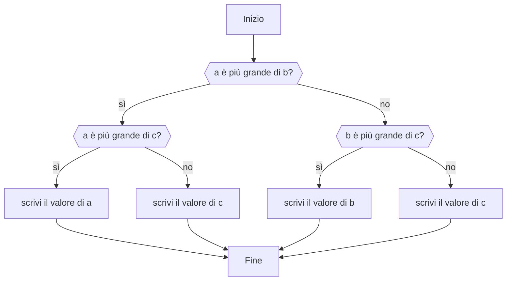

Considera questo procedimento, rappresentato come diagramma di flusso. Il procedimento si riferisce a tre **variabili** numeriche, rappresentate dalle lettere $a$, $b$ e $c$.

Questo programma viene eseguito due volte:

- La prima volta vengono assegnati alle variabili i valori $a = 7$, $b = 4$ e $c = 6$.
- La seconda volta vengono invece assegnati i valori $a = 5$, $b = 7$, $c = 9$.

Quali numeri scrive il procedimento?

- [x] 7 e 9
- [ ] 6 e 9
- [ ] 7 e 7
- [ ] 5 e 7
- [ ] 4 e 5

> Il procedimento ogni volta scrive il numero più grande tra $a$, $b$ e $c$.
>
> La prima volta che viene eseguito il programma, $a$ è più grande di $b$, si controlla quindi se $a$ è più grande di $c$. Essendo $a$ più grande di $c$, il programma scrive il valore di $a$, che è $7$.
>
> La seconda volta, $a$ è più piccolo di $b$, si controlla quindi se $b$ è più grande di $c$, ma $b$ è più piccolo di $c$. Il programma scrive quindi il valore di $c$, che è $9$.
