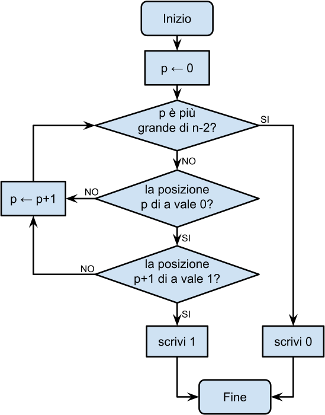

Considera il seguente procedimento, rappresentato come diagramma di flusso.

Il procedimento si riferisce ad un **lista** di numeri $a$, di dimensione rappresentata dalla **variabile** $n$.

Il procedimento viene eseguito tre volte, sempre con $n = 9$ e con i tre seguenti valori per la lista $a$:

Per quali di questi valori di $a$ il procedimento scrive 1?

- [x] Solo il valore 1.
- [ ] Solo il valore 2.
- [ ] Solo il valore 3.
- [ ] Tutti.
- [ ] Solo i valori 1 e 3.

> Il procedimento scandisce la lista di numeri dall'inizio, andando a cercare una posizione che contiene uno zero seguito da un uno: se la trova scrive $1$, altrimenti scrive $0$.
> 
> Nel primo caso il procedimento stampa $1$, infatti quando $p$ è uguale a $2$ il valore in posizione $p$ di $a$ è $0$ e il valore in posizione $p+1$ è $1$.
> 
> Nel secondo e nel terzo caso invece il procedimento stampa $0$, dato che non esiste nessun valore di $p$ tale che la posizione $p$ di $a$ sia uguale a $0$ e la posizione $p+1$ di $a$ sia uguale a $1$.
