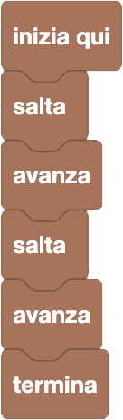

import { toolbox } from "./toolbox.ts";
import initialBlocks from "./initial-blocks.json";
import customBlocks from "./s1.blocks.yaml";
import testcases from "./testcases.py";
import Visualizer from "./visualizer.jsx";

Carol si è iscritta ad una gara di corsa ad ostacoli!
Il percorso si svolge su una sequenza di rocce, piatte o alte: si può stare solo sulle rocce piatte, mentre le rocce alte sono gli ostacoli.
Se si avanza o atterra su una roccia alta si cade, perdendo la gara.
Lo scopo della gara è di raggiungere la bandierina finale.
Hai a disposizione questi blocchi:

- `avanza`: avanza alla roccia successiva.
- `salta`: salta oltre alla prossima roccia, atterrando su quella dopo.
- `termina`: finisci la gara.

Nell'editor a blocchi qui sotto a destra, scrivi un programma che consenta ad Carol di completare la gara!

Potrai trovare tutti i blocchi che ti servono cliccando sulla sezione _"Esecuzione"_, e trascinandoli nella finestra attaccandoli sotto al blocco _"Inizia qui"_ potrai comporre il tuo programma.
Per provare la tua soluzione, premi sul pulsante verde con l'aeroplanino di carta: vedrai se è corretta, e potrai verificare il comportamento del programma tramite i
tasti blu _"Esegui/pausa"_, _"Esegui un blocco"_, _"Ricomincia da capo"_.

<Blockly
  toolbox={toolbox}
  customBlocks={customBlocks}
  initialBlocks={initialBlocks}
  testcases={testcases}
  visualizer={Visualizer}
/>

> Un possibile programma corretto è il seguente:
>
> 
>
> Secondo questo programma, il protagonista salta l'ostacolo davanti a se,
> avanza alla roccia successiva, salta il secondo ostacolo, e avanza ancora
> una volta per raggiungere la bandierina.

Prima di passare alla prossima domanda, assicurati di aver risolto questa! Se l'hai risolta, dovresti vedere una _"V"_ verde in alto a sinistra, sopra la rappresentazione del livello, dopo la scritta **Livello**.