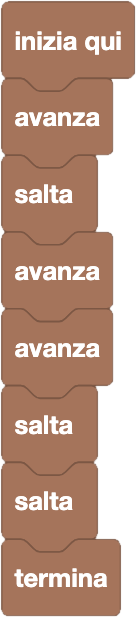

import { toolbox } from "./toolbox.ts";
import initialBlocks from "./initial-blocks.json";
import customBlocks from "./s1.blocks.yaml";
import testcases from "./testcases.py";
import Visualizer from "./visualizer.jsx";
import { Hint } from "~/utils/hint";

Siamo sempre alla corsa ad ostacoli di Carol, e hai a disposizione gli stessi blocchi di prima:

- `avanza`: avanza alla roccia successiva se possibile (sta ferma se ha davanti un ostacolo).
- `salta`: salta oltre alla prossima roccia, atterrando su quella dopo.
- `termina`: finisci la gara.

Questa volta, però, Carol deve riuscire a superare **più diversi livelli, con un solo programma!**

Quando provi la tua soluzione, premendo sul pulsante _"Correggi la soluzione"_, vedrai in un colpo solo quali livelli di questa domanda hai risolto correttamente.
I livelli sono indicati in alto a sinistra, dopo la scritta **Livello**, e per ciascuno vedrai una _"V"_ verde se l'hai superato, oppure una _"X"_ rossa se non l'hai superato.
Cliccando su uno di questi simboli, potrai scegliere il livello su cui poi provare la tua soluzione con _"Esegui/pausa"_.

Attenzione che questa domanda è piuttosto difficile... se ti senti in difficoltà, prova a leggere alcuni di questi suggerimenti:

<Hint label="suggerimento 1">
  Guarda bene tutti i livelli. Quante volte dovrai saltare?
</Hint>

<Hint label="suggerimento 2">
  Quando fai l'azione _"avanza"_, il personaggio sta fermo se ha davanti un ostacolo. Come puoi sfruttare questa cosa?
</Hint>

<Hint label="suggerimento 3">
  Guarda i livelli uno per volta: prima di ogni salto, quante volte devi avanzare per assicurarti di arrivare all'ostacolo?
</Hint>

<Blockly
  toolbox={toolbox}
  customBlocks={customBlocks}
  initialBlocks={initialBlocks}
  testcases={testcases}
  visualizer={Visualizer}
/>

> Un possibile programma corretto è il seguente:
>
> 
>
> Per capire come impostare un programma, dobbiamo vedere tutti i diversi livelli.
> - Per superare il primo livello basta andare avanti abbastanza.
> - Per superare il secondo livello, dovremo saltare tre volte, e con questo superiamo anche il primo livello.
> - Per superare anche il terzo livello, bisognerà avanzare almeno una volta prima dei primi due salti. Questa cosa non avrà effetto nel secondo livello, quindi con questo superiamo i primi tre livelli.
> - Per superare anche il quarto livello, bisognerà avanzare una seconda volta prima del secondo salto: questa cosa non avrà effetto nel secondo e terzo livello, e quindi con questo superiamo tutti i livelli.

Prima di passare alla prossima domanda, assicurati di aver risolto **tutti i livelli** di questa! Se l'hai risolta, dovresti vedere quattro _"V"_ verdi in alto a sinistra dopo la scritta **Livello**.
