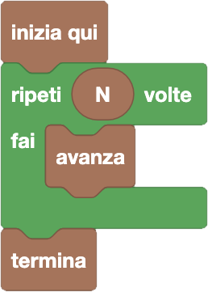

import { toolbox } from "./toolbox.ts";
import initialBlocks from "./initial-blocks.json";
import customBlocks from "./s1.blocks.yaml";
import testcases from "./testcases.py";
import Visualizer from "./visualizer.jsx";

Siamo sempre alla corsa ad ostacoli di Carol, anche se questa volta **non ci sono ostacoli!**
Sempre nella sezione _"Esecuzione"_, hai a disposizione gli stessi blocchi di prima per risolvere quattro livelli, **più uno nuovo:**

- `N`: il numero di rocce che ti separano dalla bandierina **(nuovo!)**.
- `avanza`: avanza alla roccia successiva se possibile (sta ferma se ha davanti un ostacolo).
- `salta`: salta oltre alla prossima roccia, atterrando su quella dopo.
- `termina`: finisci la gara.

Puoi notare che il nuovo blocco `N` ha una forma stondata, diversa dagli altri: questo perché non è un blocco istruzione (un blocco che _fa qualcosa_), ma un blocco che _produce un valore_
(in questo caso il numero di rocce che ti separano dalla bandierina). Non si può quindi attaccare sotto a _"Inizia qui"_, ma deve invece essere inserito dentro ad altri blocchi istruzione
(rettangolari) che contengano un spazio di simile forma stondata.

Noterai anche che è comparsa una nuova sezione _"Cicli"_! Infatti, per riuscire a risolvere il livello, avrai bisogno di usare il tuo primo ciclo _"ripeti N volte"_.
Questo blocco ti consente di specificare quante volte vuoi ripetere alcune operazioni, mettendo un blocco valore che vuoi al posto del numero standard di ripetizioni (10).
Puoi anche indicare quali sono i blocchi istruzione che vuoi ripetere, mettendoli nello spazio rettangolare che sta in mezzo al blocco.

<Blockly
  toolbox={toolbox}
  customBlocks={customBlocks}
  initialBlocks={initialBlocks}
  testcases={testcases}
  visualizer={Visualizer}
/>

> Un possibile programma corretto è il seguente:
>
> 
>
> Secondo questo programma, il protagonista avanzerà $N$ volte, superando esattamente l'ostacolo.

Prima di passare alla prossima domanda, assicurati di aver risolto **tutti i livelli** di questa! Se l'hai risolta, dovresti vedere quattro _"V"_ verdi in alto a sinistra dopo la scritta **Livello**.