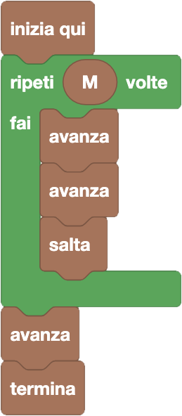

import { toolbox } from "./toolbox.ts";
import initialBlocks from "./initial-blocks.json";
import customBlocks from "./s1.blocks.yaml";
import testcases from "./testcases.py";
import Visualizer from "./visualizer.jsx";
import { Hint } from "~/utils/hint";

Siamo sempre alla corsa ad ostacoli di Carol, e di nuovo sono comparsi alcuni ostacoli.
Hai a disposizione gli stessi blocchi di prima per risolvere quattro livelli, **più uno nuovo:**

- `N`: il numero di rocce che ti separano dalla bandierina.
- `M`: il numero di ostacoli che ti separano dalla bandierina **(nuovo!)**.
- `avanza`: avanza alla roccia successiva se possibile (sta ferma se ha davanti un ostacolo).
- `salta`: salta oltre alla prossima roccia, atterrando su quella dopo.
- `termina`: finisci la gara.

Ti servirà di nuovo sfruttare i cicli. Se ti senti in difficoltà, prova anche a leggere questo suggerimento:

<Hint>
  Guarda bene tutti i livelli: prima di ogni salto, quante volte al minimo devi avanzare per assicurarti di arrivare all'ostacolo? Quante volte bisogna avanzare dopo aver saltato tutti gli ostacoli?
</Hint>

<Blockly
  toolbox={toolbox}
  customBlocks={customBlocks}
  initialBlocks={initialBlocks}
  testcases={testcases}
  visualizer={Visualizer}
/>

> Un possibile programma corretto è il seguente:
>
> 
>
> Dato che ci sono $M$ ostacoli, dobbiamo saltare $M$ volte.
> Per superare anche il terzo livello, bisogna avanzare almeno una volta prima di ogni salto.
> Per superare anche l'ultimo livello, bisogna avanzare almeno due volte prima di ogni salto, e serve avanzare un'ulteriore volta dopo i salti.
