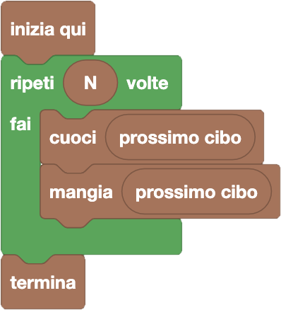

import { toolbox } from "./toolbox.ts";
import initialBlocks from "./initial-blocks.json";
import customBlocks from "./s1.blocks.yaml";
import testcases from "./testcases.py";
import Visualizer from "./visualizer.jsx";
import { Hint } from "~/utils/hint";

**Tip-Tap** deve preparare il pranzo ed ha allineato alcuni cibi che, uno per volta, vuole mangiare **dopo averli cotti.**
Hai a disposizione questi blocchi:

- `N`: il numero totale di cibi allineati.
- `prossimo cibo`: il prossimo cibo in fila da mangiare.
- `cuoci` $x$: cuoci il cibo $x$.
- `mangia` $x$: mangia il cibo $x$.
- `termina`: smetti di mangiare e vai via dal pranzo.

Scrivi un programma che consenta a Tip-Tap di pranzare come più preferisce!

Ti basterà usare gli stessi tipi di blocchi visti nella lezione precedente: blocchi istruzione (rettangolari) e blocchi valore (stondati),
che trovi nelle sezioni _"Esecuzione"_ e _"Cicli"_.
Attenzione che alcuni blocchi _"Esecuzione"_ questa volta contengono uno spazio in cui puoi inserire un altro blocco valore,
allo stesso modo di quando inserisci un blocco valore nel ciclo "ripeti N volte" per indicare quante volte ripetere.

Attenzione inoltre che **non tutti i valori sono uguali:** il blocco `N` produce un valore numerico, mentre il blocco `prossimo cibo` produce
come valore un cibo. E i numeri non si possono cuocere e mangiare...

<Hint>
  Devi ripetutamente cuocere e poi mangiare tutti gli `N` cibi in fila. Come puoi tradurre questa frase in un programma?
</Hint>

<Blockly
  toolbox={toolbox}
  customBlocks={customBlocks}
  initialBlocks={initialBlocks}
  testcases={testcases}
  visualizer={Visualizer}
/>

> Un possibile programma corretto è il seguente:
>
> 
>
> Secondo questo programma, per ognuno degli $N$ cibi che Tip-Tap vuole mangiare, il protagonista
> lo cuoce e poi lo mangia.

Prima di passare alla prossima domanda, assicurati di aver risolto **tutti i livelli** di questa!

Se l'hai risolta, dovresti vedere quattro _"V"_ verdi in alto a sinistra dopo la scritta **Livello**.