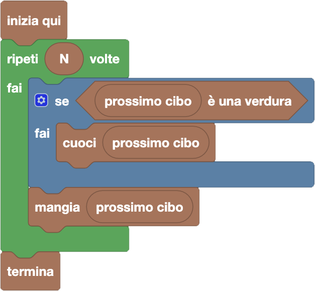

import { toolbox } from "./toolbox.ts";
import initialBlocks from "./initial-blocks.json";
import customBlocks from "./s1.blocks.yaml";
import testcases from "./testcases.py";
import Visualizer from "./visualizer.jsx";
import { Hint } from "~/utils/hint";

Anche **Bunny** è ora a pranzo e ha allineato alcuni cibi. Come Tip-Tap, anche lui cuoce le verdure; tuttavia, **non gli piace la frutta cotta.**
Hai a disposizione gli stessi blocchi di prima, più uno per capire se un cibo è frutta o verdura:

- `N`: il numero totale di cibi allineati.
- `prossimo cibo`: il prossimo cibo in fila da mangiare.
- $x$ `è una verdura`: vero se il cibo $x$ è una verdura **(nuovo!)**.
- `cuoci` $x$: cuoci il cibo $x$.
- `mangia` $x$: mangia il cibo $x$.
- `termina`: smetti di mangiare e vai via dal pranzo.

Scrivi un programma che consenta a Bunny di pranzare come più preferisce, cuocendo solo le verdure!

Nota che il blocco che controlla se un cibo è una verdura (sempre nella sezione _"Esecuzione"_) ha una forma diversa del solito, ad esagono allungato.
Nella programmazione a blocchi, questa è la forma dei _blocchi verità_, che producono un valore vero/falso! Ricapitolando i tipi di blocchi visti, ci sono:

- **blocchi istruzione (rettangolari)**, usati per fare una qualche azione;
- **blocchi valore (stondati)**, usati per produrre un valore (numerico o di altro tipo);
- **blocchi verità (esagonali)**, usati per produrre un valore di verità (vero o falso).

Tutti i blocchi possono poi contenere uno o più spazi di una qualunque forma (rettangolare, stondata o esagonale). Per esempio, i blocchi `è una verdura`, `cuoci` e
`mangia` hanno un singolo spazio stondato. Invece, il blocco "ripeti N volte" ha sia uno spazio stondato (per indicare il numero di ripetizioni) che uno spazio rettangolare
(per indicare cosa ripetere).

Puoi anche notare che ora è comparsa una nuova sezione, _"Logica"_! Per ora, in questa sezione trovi solo il blocco "se ... fai". Questo è un blocco istruzione detto
_condizionale_, che ha uno spazio esagonale (per indicare una condizione) e uno spazio rettangolare (per indicare alcune azioni). Il blocco farà quindi le azioni
indicate **solo se** la condizione risulta vera.

<Hint>
  Devi ripetutamente mangiare tutti gli `N` cibi in fila, cuocendoli prima solo se sono verdure. Come puoi tradurre questa frase in un programma?
</Hint>

<Blockly
  toolbox={toolbox}
  customBlocks={customBlocks}
  initialBlocks={initialBlocks}
  testcases={testcases}
  visualizer={Visualizer}
/>

> Un possibile programma corretto è il seguente:
>
> 
>
> Secondo questo programma, per ognuno degli $N$ cibi che Bunny vuole mangiare, il protagonista
> controlla se il prossimo cibo è una verdura, e in caso affermativo la cuoce prima di mangiarla.
> A questo punto mangia il prossimo cibo (che sia verdura o frutta), che sarà di suo gradimento:
> verdura cotta o frutta cruda.

Prima di passare alla prossima domanda, assicurati di aver risolto **tutti i livelli** di questa!