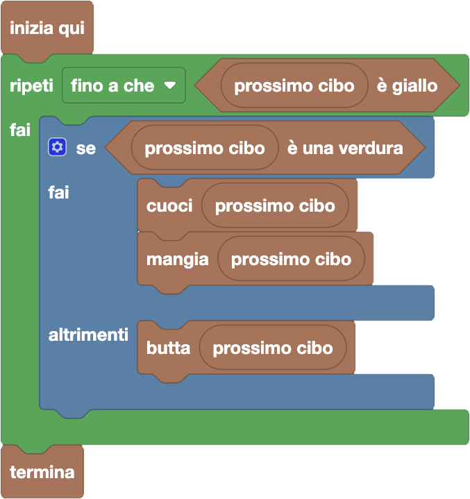

import { toolbox } from "./toolbox.ts";
import initialBlocks from "./initial-blocks.json";
import customBlocks from "./s1.blocks.yaml";
import testcases from "./testcases.py";
import Visualizer from "./visualizer.jsx";
import { Hint } from "~/utils/hint";

Anche **Allie** è ora a pranzo e ha allineato alcuni cibi. Come gli altri, anche lei cuoce le verdure; tuttavia, non gli piace affatto la frutta, né cruda né cotta.
Non solo: detesta talmente il colore giallo, che appena vede qualcosa di giallo perde l'appetito e non vuole più mangiare!
Hai a disposizione gli stessi blocchi di prima, più uno per controllare se un cibo è giallo e un'altro per scartare il cibo:

- `N`: il numero totale di cibi allineati.
- `prossimo cibo`: il prossimo cibo in fila da mangiare.
- $x$ `è una verdura`: vero se il cibo $x$ è una verdura.
- $x$ `è giallo`: vero se il cibo $x$ è giallo **(nuovo!)**.
- `cuoci` $x$: cuoci il cibo $x$.
- `mangia` $x$: mangia il cibo $x$.
- `butta` $x$: butta via il cibo $x$ **(nuovo!)**.
- `termina`: smetti di mangiare e vai via dal pranzo.

Scrivi un programma che consenta a Allie di pranzare come più preferisce, senza perdere tempo a cuocere cose prima di buttarle!

Stavolta nella sezione _"Logica"_ c'è un blocco istruzione in più: "se ... fai ... altrimenti". Anche questo è detto _condizionale_ e funziona come il "se ... fai",
però ha uno spazio rettangolare in più per indicare alcune azioni da svolgere quando la condizione (esagonale) inserita è falsa.

Inoltre, anche nella sezione _"Cicli"_ c'è un blocco istruzione in più: "ripeti mentre/fino a che", che ha uno spazio esagonale (per indicare una condizione) e uno spazio rettangolare (per indicare alcune azioni).
Nella forma di "ripeti mentre", ripete le azioni più volte mentre che la condizione è vera, fermandosi appena la condizione diventa falsa.
Dopo averlo trascinato, puoi anche cliccare sul triangolino dopo "mentre" per trasformarlo in "ripeti fino a che": in questo caso, ripete le azioni mentre che la condizione è falsa, fermandosi appena diventa vera.

<Blockly
  toolbox={toolbox}
  customBlocks={customBlocks}
  initialBlocks={initialBlocks}
  testcases={testcases}
  visualizer={Visualizer}
/>

> Un possibile programma corretto è il seguente:
>
> 
>
> Secondo questo programma, Allie continua a mangiare cibi fino a che non vede il colore giallo.
> Per ciascun cibo che incontra fino a quel momento, la protagonista
> controlla se il prossimo cibo è una verdura, e in caso affermativo la cuoce e poi la mangia.
> Altrimenti si tratta di frutta, e quindi la butta.

Prima di passare alla prossima domanda, assicurati di aver risolto **tutti i livelli** di questa!