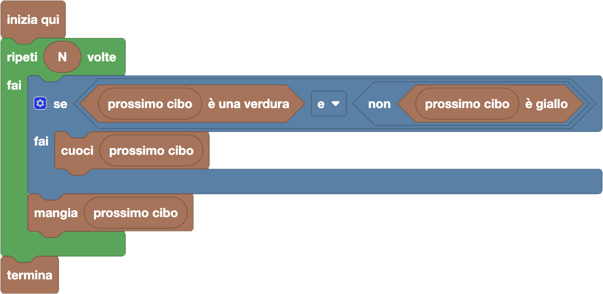

import { toolbox } from "./toolbox.ts";
import initialBlocks from "./initial-blocks.json";
import customBlocks from "./s1.blocks.yaml";
import testcases from "./testcases.py";
import Visualizer from "./visualizer.jsx";
import { Hint } from "~/utils/hint";

Anche **Carol** è ora a pranzo e ha allineato alcuni cibi. Come Bunny, anche lei mangia di tutto e preferisce mangiare la frutta cruda.
Tuttavia non cuoce tutte le verdure: **cuoce solo le verdure che non sono gialle!**
Hai a disposizione gli stessi blocchi di prima:

- `N`: il numero totale di cibi allineati.
- `prossimo cibo`: il prossimo cibo in fila da mangiare.
- $x$ `è una verdura`: vero se il cibo $x$ è una verdura.
- $x$ `è giallo`: vero se il cibo $x$ è giallo.
- `cuoci` $x$: cuoci il cibo $x$.
- `mangia` $x$: mangia il cibo $x$.
- `butta` $x$: butta via il cibo $x$.
- `termina`: smetti di mangiare e vai via dal pranzo.

Scrivi un programma che consenta a Carol di pranzare come più preferisce!

Ora nella sezione _"Logica"_ ci sono due nuovi blocchi verità (esagonali) con spazi esagonali: "e/o" (che inizialmente è "e" ma puoi trasformare in "o") e "non".
Questi blocchi sono detti _operazioni logiche_ sui valori di verità inseriti negli spazi (che chiamiamo _argomenti_), e producono come valore di verità:

- per il blocco "non", l'opposto dell'unico argomento (quindi produce falso se l'argomento è vero, e vero se l'argomento è falso);
- per il blocco "e", produce vero solo se entrambi gli argomenti sono veri, e falso in tutti gli altri casi;
- per il blocco "o", produce falso solo se entrambi gli argomenti sono falsi, e vero in tutti gli altri casi.

Se ci pensi, questo è lo stesso significato che hanno le congiunzioni "e", "o" e "non" in italiano!

<Hint>
  Il comportamento di Carol è diverso da quello di Allie ma molto simile a quello di Bunny, cambiando solo la condizione secondo cui decide di cuocere i cibi: li cuoce se sono verdura e non gialli. Come puoi tradurre questa condizione in blocchi?
</Hint>

<Blockly
  toolbox={toolbox}
  customBlocks={customBlocks}
  initialBlocks={initialBlocks}
  testcases={testcases}
  visualizer={Visualizer}
/>

> Un possibile programma corretto è il seguente:
>
> 
>
> Secondo questo programma, per ognuno degli $N$ cibi che Carol vuole mangiare, il protagonista
> controlla se il prossimo cibo è una verdura *e* non è giallo, e in caso affermativo lo cuoce prima di mangiarlo.
> A questo punto mangia il prossimo cibo (che sia verdura o frutta, gialla o no), che sarà di suo gradimento.
