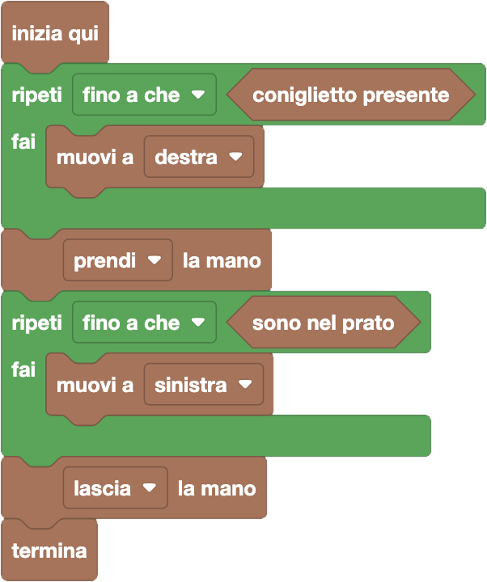

import { toolbox } from "./toolbox.ts";
import initialBlocks from "./initial-blocks.json";
import customBlocks from "./s1.blocks.yaml";
import testcases from "./testcases.py";
import Visualizer from "./visualizer.jsx";
import { Hint } from "~/utils/hint";

Alla Fattoria Fibonacci è l'ora della ricreazione per i coniglietti più piccoli, in cui si gioca tutti insieme nel prato!
Tuttavia, uno di loro è rimasto nella fattoria, e Bunny è stato incaricato di andarlo a prendere.
La Fattoria Fibonacci è fatta da alcune stanze disposte in fila e separate da porte, come un lungo corridoio.
All'inizio Bunny è nel prato, che sta a sinistra delle stanze.
Hai a disposizione questi blocchi:

- `N`: il numero di stanze.
- `sono nel prato`: vero se è Bunny è nel prato.
- `muovi a destra/sinistra`: spostati nella stanza (o prato) a destra/sinistra della stanza (o prato) corrente.
- `coniglietto presente`: vero se è presente un coniglietto nella stanza corrente.
- `prendi/lascia la mano`: prendi/lascia la mano del coniglietto nella stanza corrente.
- `termina`: comincia la ricreazione.

Mentre che Bunny tiene il coniglietto per mano, il coniglietto seguirà tutti gli spostamenti di Bunny.
Aiuta Bunny a raccogliere il coniglietto mancante e portarlo nel prato prima di cominciare la ricreazione!

Ti basterà usare gli stessi tipi di blocchi visti nella lezione precedente:

- **blocchi istruzione (rettangolari)**, usati per fare una qualche azione (inclusi cicli e condizionali);
- **blocchi valore (stondati)**, usati per produrre un valore (numerico o di altro tipo);
- **blocchi verità (esagonali)**, usati per produrre un valore di verità (vero o falso).

Attenzione che alcuni blocchi _"Esecuzione"_ questa volta possono essere modificati come si fa con i blocchi "e/o" e "ripeti mentre/fino a che":
hanno quindi delle parti (destra/sinistra, prendi/lascia) che possono essere modificate cliccando sul triangolino a lato della scritta.

<Hint>
  Come fare un primo ciclo per raggiungere il coniglietto? Come fare un secondo ciclo per uscire nel prato?
</Hint>

<Blockly
  toolbox={toolbox}
  customBlocks={customBlocks}
  initialBlocks={initialBlocks}
  testcases={testcases}
  visualizer={Visualizer}
/>

> Un possibile programma corretto è il seguente:
>
> 
>
> Come prima cosa, Bunny deve raggiungere il coniglietto nella fattoria.
> Quindi continua ad andare verso destra, ripetendo fino a che il coniglietto non è presente nella stanza in cui si trova, per poi prendergli la mano.
>
> A questo punto, Bunny deve uscire dalla fattoria.
> Continua quindi ad andare verso sinistra (portandosi dietro il coniglietto), ripetendo fino a che non arriva nel prato.
> A questo punto può lasciare la mano del coniglietto e dare il via alla ricreazione!

Prima di passare alla prossima domanda, assicurati di aver risolto **tutti i livelli** di questa!