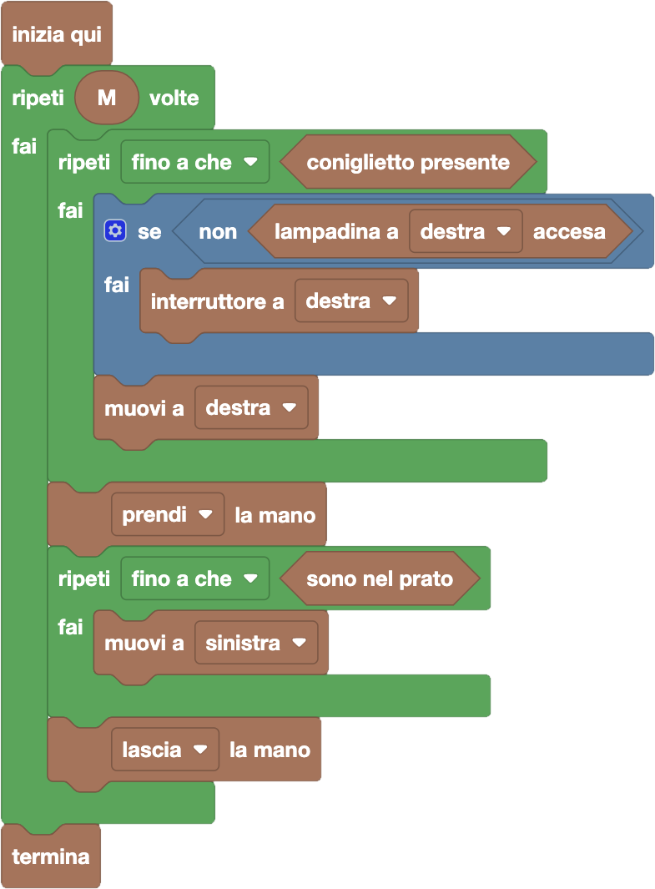

import { toolbox } from "./toolbox.ts";
import initialBlocks from "./initial-blocks.json";
import customBlocks from "./s1.blocks.yaml";
import testcases from "./testcases.py";
import Visualizer from "./visualizer.jsx";
import { Hint } from "~/utils/hint";

È di nuovo l'ora della ricreazione. Oggi, però, ci sono diversi coniglietti che sono rimasti nella fattoria!
Non solo: alcune delle luci della fattoria potrebbero essere spente. Questo è un problema perché Bunny ha paura del buio,
quindi non è disposto ad entrare in una stanza se prima non ne accende la luce. In ogni stanza ci sono due interruttori,
che servono per accendere le lampadine delle stanze a destra e a sinistra. La luce della prima stanza si può comandare anche dall'esterno.
Quando un interruttore viene premuto, accende la lampadina se è spenta e la spegne se è accesa.

Bunny parte di nuovo dal prato e deve andare a prendere tutti i coniglietti. Hai a disposizione questi blocchi:

- `N`: il numero di stanze nella fattoria.
- `M`: il numero di coniglietti da recuperare **(nuovo!)**.
- `sono nel prato`: vero se è Bunny è nel prato.
- `muovi a destra/sinistra`: spostati nella stanza (o prato) a destra/sinistra della stanza (o prato) corrente.
- `coniglietto presente`: vero se è presente un coniglietto nella stanza corrente.
- `prendi/lascia la mano`: prendi/lascia la mano del coniglietto nella stanza corrente.
- `lampadina a destra/sinistra accesa`: vero se la lampadina nella stanza a destra/sinistra è accesa **(nuovo!)**.
- `interruttore a destra/sinistra`: premi l'interruttore che comanda la stanza a destra/sinistra **(nuovo!)**.
- `termina`: comincia la ricreazione.

Aiuta Bunny a raccogliere tutti i coniglietti (senza stare al buio) prima di cominciare la ricreazione!

<Hint>
  Prova a riutilizzare il programma che risolve la scorsa domanda. Come dovrai modificarlo?
</Hint>

<Blockly
  toolbox={toolbox}
  customBlocks={customBlocks}
  initialBlocks={initialBlocks}
  testcases={testcases}
  visualizer={Visualizer}
/>

> Un possibile programma corretto è il seguente:
>
> 
>
> Innanzitutto, si può notare che il programma è molto simile alla domanda precedente, con due modifiche:
> - ci sono `M` coniglietti, e quindi l'intero programma va inserito dentro ad un ciclo "ripeti M volte";
> - ci sono lampadine spente, che vanno accese.
>
> Visto che non ci viene chiesto di spegnere le lampadine, possiamo limitarci ad accenderle (dove necessario)
> prima di andare verso destra. Questo si può fare controllando se la lampadina a destra non è accesa,
> e in caso premendo l'interruttore corrispondente.

Prima di passare alla prossima domanda, assicurati di aver risolto **tutti i livelli** di questa!