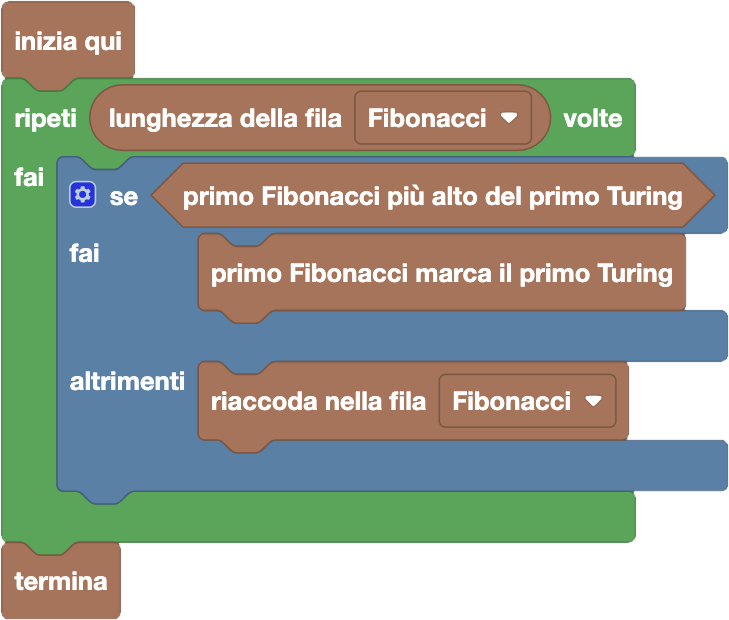

import { toolbox } from "./toolbox.ts";
import initialBlocks from "./initial-blocks.json";
import customBlocks from "./s3.blocks.yaml";
import testcases from "./testcases.py";
import Visualizer from "./visualizer.jsx";
import { Hint } from "~/utils/hint";

La fattoria Turing ha mandato una squadra a sfidare la fattoria Fibonacci a basket!
Bunny ora deve selezionare tra i conigli della fattoria Fibonacci una squadra con cui competere con la fattoria rivale.
Per avere le migliori possibilità di vittoria, ha deciso che vuole assegnare a ogni elemento della squadra
Turing un coniglio della fattoria Fibonacci che sia **più alto di lui**, di modo che possa marcarlo facilmente.

Bunny ha quindi messo in fila, in ordine crescente di altezza, i conigli di entrambe le fattorie.
Ora può fare queste operazioni:

- `lunghezza della fila Fibonacci/Turing`: in numero di conigli nella fila della fattoria Fibonacci/Turing.
- `riaccoda nella fila Fibonacci/Turing`: manda il prossimo coniglio della fila della fattoria Fibonacci/Turing in fondo alla rispettiva fila.
- `primo Fibonacci più alto del primo Turing`: condizione vera se ci sono conigli in entrambe le file, e il primo coniglio nella fila Fibonacci è più alto del primo coniglio nella fila Turing.
- `primo Fibonacci marca il primo Turing`: metti in squadra il primo coniglio della fila Fibonacci a marcare il primo coniglio della fila Turing. **Attenzione:** questa operazione toglie entrambi i conigli dalle rispettive file.
- `termina`: inizia la partita a basket con le squadre selezionate.

Aiuta Bunny a fare le squadre per la partita, ma attenzione: potrai usare **un solo ciclo ripeti N!**

<Hint>
  In quale caso il primo Fibonacci può marcare il primo Turing?
  E se non può, cosa conviene fare?
</Hint>

<Blockly
  toolbox={toolbox}
  customBlocks={customBlocks}
  initialBlocks={initialBlocks}
  testcases={testcases}
  visualizer={Visualizer}
/>

> Un possibile programma corretto è il seguente:
>
> 
>
> Questo programma considera uno per volta tutti i conigli della fattoria Fibonacci.
> Se il primo della fila Fibonacci è abbastanza alto viene assegnato come marcatore,
> altrimenti viene scartato (mandandolo in fondo alla fila). Non ci servirà considerarlo
> di nuovo, tanto se era troppo basso per questo avversario, è anche troppo basso per
> tutti gli avversari successivi!

Prima di passare alla prossima domanda, assicurati di aver risolto **tutti i livelli** di questa!
