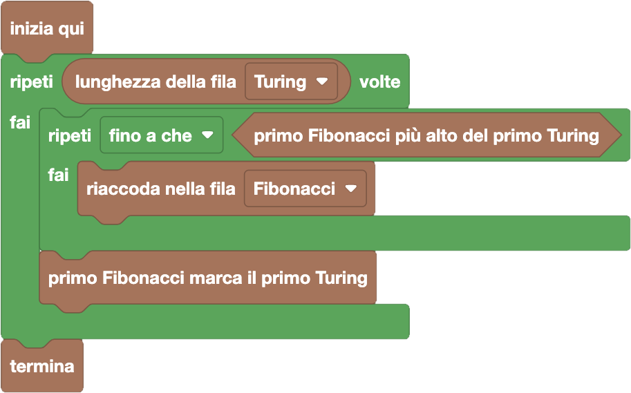

import { toolbox } from "./toolbox.ts";
import initialBlocks from "./initial-blocks.json";
import customBlocks from "./s3.blocks.yaml";
import testcases from "./testcases.py";
import Visualizer from "./visualizer.jsx";
import { Hint } from "~/utils/hint";

La fattoria Turing ha mandato un'altra squadra per avere la rivincita!
Bunny vorrebbe procedere come l'altra volta, tuttavia stavolta non sta riuscendo a far mettere in ordine
altezza i suoi compagni conigli. Non solo: la squadra Turing si è voluta mettere in ordine **decrescente**
di altezza. Le operazioni a sua disposizione sono le stesse di prima:

- `lunghezza della fila Fibonacci/Turing`: in numero di conigli nella fila della fattoria Fibonacci/Turing.
- `riaccoda nella fila Fibonacci/Turing`: manda il prossimo coniglio della fila della fattoria Fibonacci/Turing in fondo alla rispettiva fila.
- `primo Fibonacci più alto del primo Turing`: condizione vera se ci sono conigli in entrambe le file, e il primo coniglio nella fila Fibonacci è più alto del primo coniglio nella fila Turing.
- `primo Fibonacci marca il primo Turing`: metti in squadra il primo coniglio della fila Fibonacci a marcare il primo coniglio della fila Turing. **Attenzione:** questa operazione toglie entrambi i conigli dalle rispettive file.
- `termina`: inizia la partita a basket con le squadre selezionate.

Aiuta Bunny a fare le squadre per la partita, assegnando a ogni elemento della squadra
Turing un coniglio della fattoria Fibonacci che sia più alto di lui.
Attenzione: stavolta dovrai usare **due diversi cicli annidati!**

<Hint>
  Come puoi trovare un marcatore per il primo giocatore della squadra Turing?
  Se ci riesci, prova a rifare lo stesso procedimento per tutti i giocatori.
</Hint>

<Blockly
  toolbox={toolbox}
  customBlocks={customBlocks}
  initialBlocks={initialBlocks}
  testcases={testcases}
  visualizer={Visualizer}
/>

> Un possibile programma corretto è il seguente:
>
> 
>
> Questo programma procede a scegliere un marcatore per ogni elemento della squadra Turing
> nell'ordine dato (dal più alto al più basso). Per ognuno di loro itera sui conigli della
> fattoria Fibonacci, rimandandoli in fondo alla fila finché non ne trova uno che è un
> marcatore valido. Questo procedimento funziona, perché i prossimi elementi della squadra
> Turing saranno più bassi di quello attuale, e quindi possiamo giocarci subito uno dei conigli
> più alti senza preoccuparci del futuro!

Prima di passare alla prossima domanda, assicurati di aver risolto **tutti i livelli** di questa!
