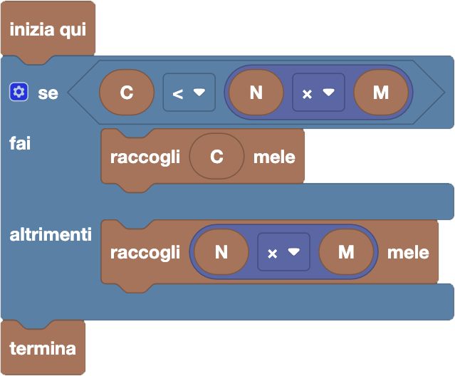

import { toolbox } from "./toolbox.ts";
import initialBlocks from "./initial-blocks.json";
import customBlocks from "./s1.blocks.yaml";
import testcases from "./testcases.py";
import Visualizer from "./visualizer.jsx";
import { Hint } from "~/utils/hint";

Tip-Tap ha alcuni alberi di mele nel suo giardino, ciascuno con lo stesso numero di mele.
Tip-Tap vuole raccogliere più mele possibile, ma ha soltanto un cestino grande abbastanza per alcune mele:
se ne raccogliesse più di quante ce ne stanno nel cestino, finirebbero per cadere dappertutto!
Hai a disposizione questi blocchi:

- `N`: il numero di alberi di mele.
- `M`: il numero di mele in ciascun albero.
- `C`: il numero massimo di mele che può contenere il cestino.
- `raccogli` $x$ `mele`: raccogli $x$ mele dagli alberi, mettendole nel cestino.
- `termina`: riporta il cestino a casa.

Aiuta Tip-Tap a raccogliere più mele possibile, senza sfondare il suo cestino!

Per risolvere questo problema, dovrai usare una nuova categoria di blocchi _"Matematica"_,
che consentono di fare semplici operazioni aritmetiche su blocchi valore numerici (stondati).
Inoltre, ti servirà anche un nuovo blocco verità (esagonale) che trovi all'inizio della
categoria _"Logica"_, che serve a confrontare due blocchi valore numerici.

<Hint>
  Ci sono due casi che devi considerare, quali sono?
</Hint>

<Blockly
  toolbox={toolbox}
  customBlocks={customBlocks}
  initialBlocks={initialBlocks}
  testcases={testcases}
  visualizer={Visualizer}
/>

> Un possibile programma corretto è il seguente:
>
> 
>
> Ci sono due casi: il cestino non è abbastanza grande per contenere tutte le mele, oppure lo è.
> Nel primo caso, raccogliamo mele fino a riempire il cestino.
> Nel secondo caso, raccogliamo tutte le mele dagli alberi.

Prima di passare alla prossima domanda, assicurati di aver risolto **tutti i livelli** di questa!