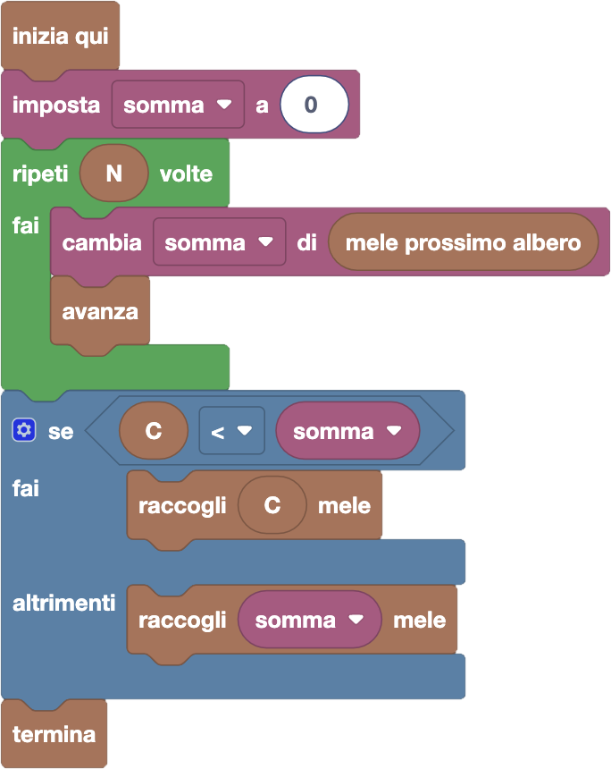

import { toolbox } from "./toolbox.ts";
import initialBlocks from "./initial-blocks.json";
import customBlocks from "./s2.blocks.yaml";
import testcases from "./testcases.py";
import Visualizer from "./visualizer.jsx";
import { Hint } from "~/utils/hint";

Dopo l'ultimo raccolto, alcune altre mele sono maturate! Stavolta, però, ogni albero ha un numero diverso di mele.
Hai a disposizione questi blocchi:

- `N`: il numero di alberi di mele.
- `mele prossimo albero`: il numero di mele nell'albero di fronte a Tip-Tap **(nuovo!)**.
- `passa all'albero successivo`: Tip-Tap avanza all'albero successivo **(nuovo!)**.
- `C`: il numero massimo di mele che può contenere il cestino.
- `raccogli` $x$ `mele`: raccogli $x$ mele dagli alberi, mettendole nel cestino.
- `termina`: riporta il cestino a casa.

Aiuta Tip-Tap a raccogliere più mele possibile, senza sfondare il suo cestino!

Per risolvere questo problema, dovrai usare una nuova categoria di blocchi: le _"Variabili"_.
Le variabili sono dei contenitori in cui puoi memorizzare dei numeri, per poi riusarli e modificarli
in seguito. Quando inizi a fare un nuovo programma, non ci sono variabili: devi aggiungerle
tu quando ti servono, cliccando su _"crea variabile"_ nella sezione _"Variabili"_. Potrai quindi
scegliere un nome da dare alla tua variabile: scegli pure quello che preferisci, ma è meglio
se il nome che gli dai ti aiuta a ricordarti quale valore ci vuoi mettere dentro!

Una volta creata una variabile, vedrai comparire alcuni blocchi nella sezione _"Variabili"_:
- il blocco istruzione **imposta _variabile_ a _valore_**, con cui puoi memorizzare un valore nella variabile;
- il blocco istruzione **cambia _variabile_ di _valore_**, con cui puoi sommare un valore al contenuto attuale della variabile;
- un blocco numerico con il nome della variabile, per leggerne il suo contenuto.

<Hint>
  Nella scorsa domanda il numero totale di mele era $N \times M$.
  Con una variabile e un ciclo, riesci a calcolare quante mele ci sono in totale ora,
  per poi sfruttare la soluzione della domanda precedente?
</Hint>

<Blockly
  toolbox={toolbox}
  customBlocks={customBlocks}
  initialBlocks={initialBlocks}
  testcases={testcases}
  visualizer={Visualizer}
/>

> Un possibile programma corretto è il seguente:
>
> 
>
> Innanzitutto, Tip-Tap scorre tutti gli alberi, aggiungendo il numero di mele di ciascun albero alla
> variabile somma, che inizialmente vale zero.
>
> Poi, decide quante mele raccogliere tra la somma e C, come nella domanda precedente.

Prima di passare alla prossima domanda, assicurati di aver risolto **tutti i livelli** di questa!