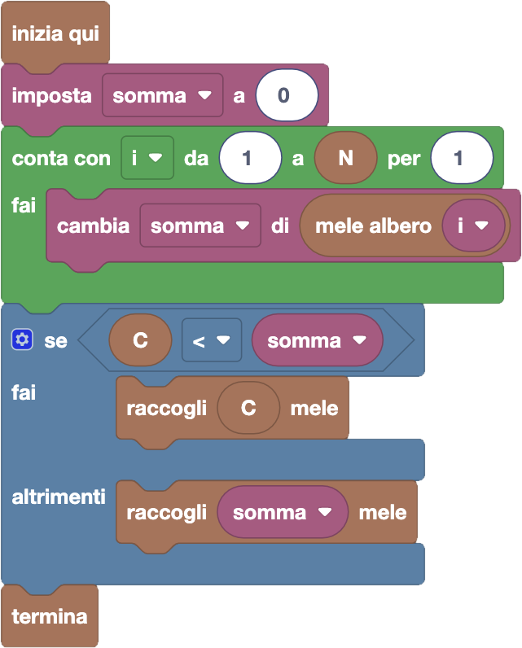

import { toolbox } from "./toolbox.ts";
import initialBlocks from "./initial-blocks.json";
import customBlocks from "./s3.blocks.yaml";
import testcases from "./testcases.py";
import Visualizer from "./visualizer.jsx";
import { Hint } from "~/utils/hint";

Tip-Tap è alle prese con ancora un altro raccolto di mele!
Anche stavolta ogni albero ha un numero diverso di mele.
Tuttavia, ora Tip-Tap indossa delle lenti a contatto e riesce
a contare le mele anche negli alberi più lontani senza spostarsi.
Hai a disposizione questi blocchi:

- `N`: il numero di alberi di mele.
- `mele albero` $x$: il numero di mele nell'albero $x$-esimo **(nuovo!)**.
- `C`: il numero massimo di mele che può contenere il cestino.
- `raccogli` $x$ `mele`: raccogli $x$ mele dagli alberi, mettendole nel cestino.
- `termina`: riporta il cestino a casa.

Aiuta di nuovo Tip-Tap a raccogliere più mele possibile, senza sfondare il suo cestino!

Per risolvere questo problema dovrai usare un nuovo blocco, detto **ciclo contatore**,
che si trova nella categoria _"Cicli"_. Quando aggiungi questo ciclo al tuo programma,
una nuova variabile si crea automaticamente, usando il nome convenzionale $i$ (e se
aggiungi altri cicli contatore, i nomi seguenti $j$, $k$, ecc). Il ciclo ti chiede poi
di specificare un intervallo numerico di valori "da/a" e un incremento "per". Quando
il ciclo verrà eseguito, tutte le istruzioni contenute saranno ripetute più volte, ogni
volta aggiornando il valore della variabile contatore del ciclo, partendo dal valore
"da" e aumentandolo del valore "per" fino a raggiungere il valore "a".

<Hint>
  Puoi riutilizzare la stessa struttura della scorsa domanda.
  Basta sostituire il ciclo ripeti N con un ciclo contatore!
</Hint>

<Blockly
  toolbox={toolbox}
  customBlocks={customBlocks}
  initialBlocks={initialBlocks}
  testcases={testcases}
  visualizer={Visualizer}
/>

> Un possibile programma corretto è il seguente:
>
> 
>
> Come nella domanda precedente, innanzitutto Tip-Tap conta il numero totale di mele.
> Tuttavia, questa volta lo fa con un ciclo contatore, iterando su tutti gli alberi dal
> primo all'$N$-esimo, e ogni volta aggiungendo il numero di mele dell'albero alla somma.
> Infine, decide se raccogliere tutte le mele o $C$ mele, a seconda di quale sia più piccolo.

Prima di passare alla prossima domanda, assicurati di aver risolto **tutti i livelli** di questa!