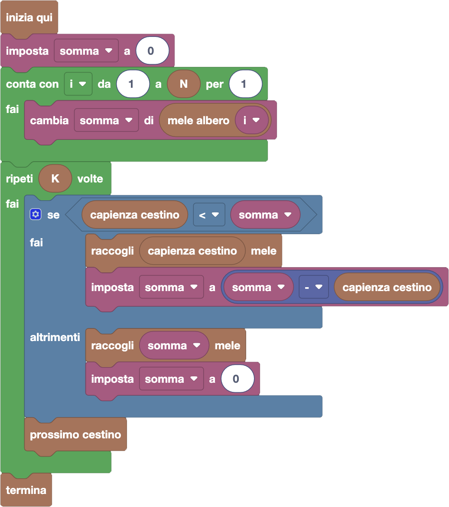

import { toolbox } from "./toolbox.ts";
import initialBlocks from "./initial-blocks.json";
import customBlocks from "./s4.blocks.yaml";
import testcases from "./testcases.py";
import Visualizer from "./visualizer.jsx";
import { Hint } from "~/utils/hint";

È l'ora di un ultimo raccolto di mele per Tip-Tap!
Ogni albero ha di nuovo un numero diverso di mele, e Tip-Tap riesce ancora a contare le mele da lontano.
Stavolta, tuttavia, Tip-Tap ha diversi cestini, ognuno con una sua capienza massima.
Hai a disposizione questi blocchi:

- `N`: il numero di alberi di mele.
- `mele albero` $x$: il numero di mele nell'albero $x$-esimo.
- `K`: il numero di cestini che ha Tip-Tap **(nuovo!)**.
- `capienza cestino`: il numero massimo di mele che può contenere il cestino corrente **(nuovo!)**.
- `prossimo cestino`: passa al prossimo cestino **(nuovo!)**.
- `raccogli` $x$ `mele`: raccogli $x$ mele dagli alberi, mettendole nel cestino corrente.
- `termina`: termina la raccolta.

Aiuta di nuovo Tip-Tap a raccogliere più mele possibile senza sfondare nessun cestino.
Questa volta non ci sono nuovi blocchi che ti serve usare: basta padroneggiare quelli che già hai visto
nelle domande precedenti!

<Hint label="suggerimento 1">
  Cerca di riutilizzare la soluzione della domanda precedente.
  Dove serve modificare il programma per considerare $K$ cestini invece che uno solo?
</Hint>

<Hint label="suggerimento 2">
  Ogni volta che consideri un cestino, devi decidere quante mele raccogliere in quel cestino.
  In che modo bisogna modificare il totale di mele rimanenti sugli alberi, dopo aver fatto la raccolta?
</Hint>

<Blockly
  toolbox={toolbox}
  customBlocks={customBlocks}
  initialBlocks={initialBlocks}
  testcases={testcases}
  visualizer={Visualizer}
/>

> Un possibile programma corretto è il seguente:
>
> 
>
> Come nella domanda precedente, innanzitutto Tip-Tap conta il numero totale di mele
> con un ciclo contatore. Poi itera su tutti e $K$ i cestini, ogni volta considerando
> se il numero di mele rimaste sugli alberi (nella variabile _somma_) sia più piccolo
> o meno della capienza del cestino corrente. Come nelle domande precedenti, raccoglie
> quindi mele pari al minore dei due numeri. Inoltre, questa volta aggiorna anche la
> variabile _somma_ togliendoci il numero di mele che sono state raccolte, prima di
> passare al cestino successivo.