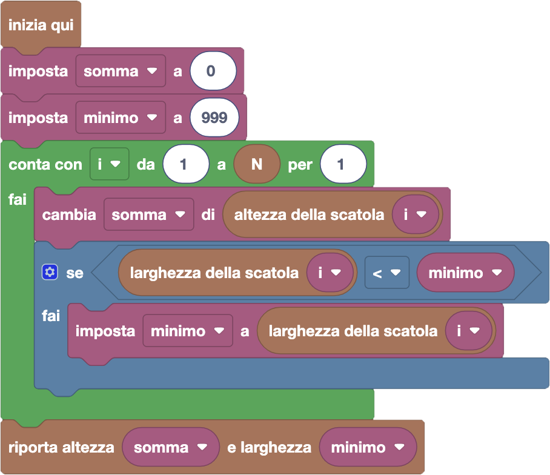

import { toolbox } from "./toolbox.ts";
import initialBlocks from "./initial-blocks.json";
import customBlocks from "./s1.blocks.yaml";
import testcases from "./testcases.py";
import Visualizer from "./visualizer.jsx";
import { Hint } from "~/utils/hint";

Bunny e i suoi amici stanno cercando gli ovetti di pasqua nascosti in giro per la fattoria Fibonacci!
Bunny è convinto che ci siano ovetti nascosti anche sui tetti, quindi ha deciso di costruire una
torre che gli consenta di arrivare più in alto.
Per farlo, ha impilato $N$ scatole rettangolari di varie dimensioni.
Hai a disposizione questi blocchi:

- `N`: il numero di scatole impilate.
- `altezza della scatola` $i$: l'altezza della $i$-esima scatola.
- `larghezza della scatola` $i$: la larghezza della $i$-esima scatola.
- `riporta altezza` $h$ `e larghezza` $w$: termina il programma riportando il numero $h$ come altezza totale della torre, e il numero $w$ come larghezza **minima** della torre.

Aiuta Bunny a capire le dimensioni della sua torre!
**Attenzione** che Bunny vuole capire se la torre può reggere il suo peso, e quindi per la larghezza conta solo il punto **più stretto** della torre.

<Hint label="suggerimento 1">
  In questo problema non ci sono scelte, quindi non servirà trovare una soluzione greedy.
  Possiamo invece sfruttare le cose viste nella quarta lezione: quali possono tornarti utili per fare i calcoli richiesti?
</Hint>

<Hint label="suggerimento 2">
  Calcolare l'altezza è molto simile al problema 3 della quarta lezione.
  Calcolare la larghezza è anche simile a calcolare la larghezza, ma bisogna aggiungere un controllo condizionale.
</Hint>

<Blockly
  toolbox={toolbox}
  customBlocks={customBlocks}
  initialBlocks={initialBlocks}
  testcases={testcases}
  visualizer={Visualizer}
/>

> Un possibile programma corretto è il seguente:
>
> 
>
> In questo programma abbiamo creato una variabile che chiamiamo _"somma"_, che parte da zero
> e aggiorneremo fino ad arrivare all'altezza totale della torre.
> Abbiamo inoltre creato anche una variabile che chiamiamo _"minimo"_, che parte da un numero più grande
> di tutte le dimensioni delle scatole (999), e aggiorneremo fino ad arrivare alla larghezza minima della torre.
>
> Per portare le due variabili al loro valore finale, iteriamo con un ciclo contatore su tutte le 
> scatole dalla prima all'ultima. Aggiorniamo la variabile _somma_ aggiungendoci l'altezza della
> scatola corrente. Inoltre, se la larghezza della scatola corrente è minore della larghezza della
> parte di torre finora esaminata (nella variabile _minimo_), aggiorniamo anche la variabile _minimo_
> ponendola pari alla larghezza della scatola corrente.
> Alla fine del ciclo, riportiamo il valore delle due variabili come altezza e larghezza della torre.

Prima di passare alla prossima domanda, assicurati di aver risolto **tutti i livelli** di questa!