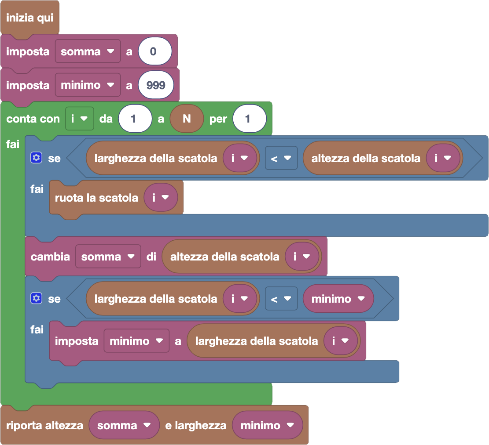

import { toolbox } from "./toolbox.ts";
import initialBlocks from "./initial-blocks.json";
import customBlocks from "./s2.blocks.yaml";
import testcases from "./testcases.py";
import Visualizer from "./visualizer.jsx";
import { Hint } from "~/utils/hint";

Dopo aver misurato la sua torre, Bunny (che alla fine è pur sempre un coniglio) ha paura che non sia
abbastanza larga per reggere il suo peso! Vuole quindi provare a rendere la torre **più larga possibile**,
ruotando alcune delle scatole che la compongono. Hai a disposizione questi blocchi:

- `N`: il numero di scatole impilate.
- `altezza della scatola` $i$: l'altezza della $i$-esima scatola.
- `larghezza della scatola` $i$: la larghezza della $i$-esima scatola.
- `ruota la scatola i`: ruota di 90 gradi la scatola $i$-esima, scambiando quindi di conseguenza
  la sua altezza con la sua larghezza **(nuovo!)**.
- `riporta altezza` $h$ `e larghezza` $w$: termina il programma riportando il numero $h$ come altezza totale della torre, e il numero $w$ come larghezza minima della torre.

Aiuta Bunny a realizzare la torre più larga, riportando anche la nuova altezza e larghezza della torre
dopo la rotazione delle scatole!

Nota che questa volta Bunny ha da effettuare una sequenza di scelte: per ogni scatola, deve decidere se
ruotarla o meno! In questa domanda, potrai ottenere il risultato migliore seguendo un _algoritmo greedy_ (goloso),
in cui ogni scelta viene presa senza considerare le conseguenze sulle scelte future. Anche se questa strategia
non funziona in tutti i problemi, funziona in questo problema perché qui in effetti le diverse scelte non si
influenzano a vicenda.

<Hint label="suggerimento 1">
  Anche qui dovrai poi calcolare l'altezza e larghezza della torre, quindi ti conviene partire dal programma
  della scorsa domanda. Prima di considerare l'altezza e larghezza di una scatola, cosa puoi fare?
</Hint>

<Hint label="suggerimento 2">
  Differentemente dalla scorsa domanda, ora puoi ruotare le scatole, e quindi hai delle scelte:
  ruotare o non ruotare ogni scatola. Applicando un ragionamento greedy, concentrati su una sola
  scatola: quando ti conviene ruotarla per rendere la torre più larga?
</Hint>

<Blockly
  toolbox={toolbox}
  customBlocks={customBlocks}
  initialBlocks={initialBlocks}
  testcases={testcases}
  visualizer={Visualizer}
/>

> Un possibile programma corretto è il seguente:
>
> 
>
> Questo programma è uguale al programma che risolve la domanda precedente, con l'aggiunta di un
> singolo blocco condizionale come primo blocco all'interno del ciclo contatore.
> Quindi, prima di considerare l'altezza e larghezza di una scatola, dobbiamo fare una scelta:
> ruotarla o non ruotarla? Questa scelta possiamo farla in modo greedy, e cioè senza preoccuparci
> di come saranno le scatole successive.
>
> Quindi, ci basta controllare se per caso la sua larghezza fosse minore della sua altezza.
> Se sì ci conviene ruotarla, per allargare la torre al massimo, e quindi la ruotiamo prima
> di considerarla nel calcolo di altezza e larghezza totale.

Prima di passare alla prossima domanda, assicurati di aver risolto **tutti i livelli** di questa!