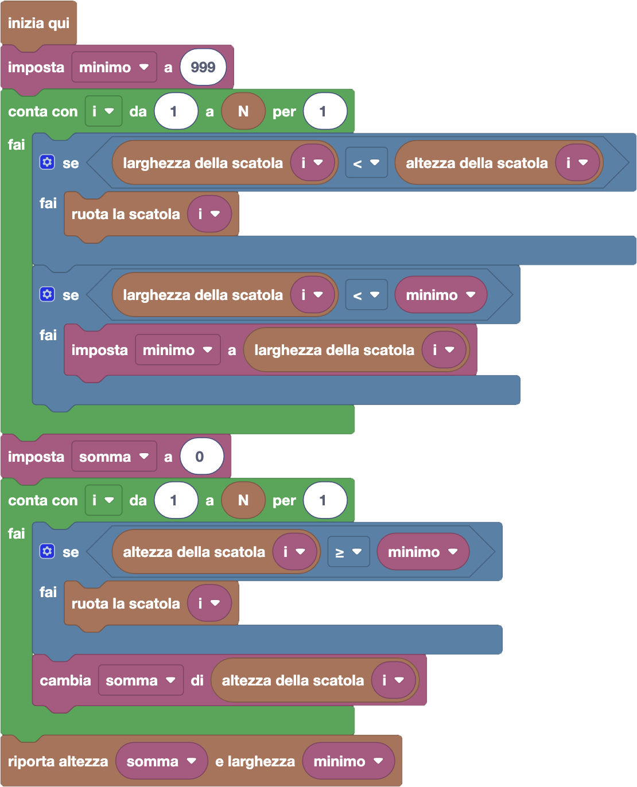

import { toolbox } from "./toolbox.ts";
import initialBlocks from "./initial-blocks.json";
import customBlocks from "./s3.blocks.yaml";
import testcases from "./testcases.py";
import Visualizer from "./visualizer.jsx";
import { Hint } from "~/utils/hint";

Dopo aver allargato al massimo la sua torre e averla usata per raccogliere alcuni ovetti,
Bunny si è accorto che ora non è abbastanza alta per raggiungere gli ovetti sui tetti più alti.
Ha quindi deciso che, mantenendo comunque la larghezza massima, vuole anche rendere la torre più
alta possibile. Hai a disposizione gli stessi blocchi di prima:

- `N`: il numero di scatole impilate.
- `altezza della scatola` $i$: l'altezza della $i$-esima scatola.
- `larghezza della scatola` $i$: la larghezza della $i$-esima scatola.
- `ruota la scatola i`: ruota di 90 gradi la scatola $i$-esima, scambiando quindi di conseguenza
  la sua altezza con la sua larghezza.
- `riporta altezza` $h$ `e larghezza` $w$: termina il programma riportando il numero $h$ come
  altezza totale della torre, e il numero $w$ come larghezza minima della torre.

Aiuta Bunny a realizzare la torre **più alta tra quelle con larghezza massima**, riportando anche la nuova
altezza e larghezza della torre dopo la rotazione delle scatole!

<Hint label="suggerimento 1">
  Devi soddisfare due richieste: tenere la larghezza massima, e a parità l'altezza massima.
  Conviene scrivere una soluzione in due passaggi: soddisfa prima una delle due richieste,
  e poi pensa all'altra.
</Hint>

<Hint label="suggerimento 2">
  Prima pensa ad ottenere la larghezza massima, e per quello puoi usare la soluzione del problema precedente.
  Poi pensa ad ottenere l'altezza massima: anche qui dovrai scegliere se ruotare o non ruotare ogni scatola
  in modo greedy, ma sfruttando il fatto che ora già conosci la larghezza che vuoi ottenere.
  Quando puoi permetterti di ruotare una scatola, migliorando l'**altezza totale** senza peggiorare la **larghezza minima**?
</Hint>

<Blockly
  toolbox={toolbox}
  customBlocks={customBlocks}
  initialBlocks={initialBlocks}
  testcases={testcases}
  visualizer={Visualizer}
/>

> Un possibile programma corretto è il seguente:
>
> 
>
> Questo programma è uguale al programma che risolve la domanda precedente, con l'aggiunta di un
> singolo blocco condizionale come primo blocco all'interno del ciclo contatore.
> Quindi, prima di considerare l'altezza e larghezza di una scatola, dobbiamo fare una scelta:
> ruotarla o non ruotarla? Questa scelta possiamo farla in modo "greedy", e cioè senza preoccuparci
> di come saranno le scatole successive.
>
> Quindi, ci basta controllare se per caso la sua larghezza fosse minore della sua altezza.
> Se sì ci conviene ruotarla, per allargare la torre al massimo, e quindi la ruotiamo prima
> di considerarla nel calcolo di altezza e larghezza totale.

Prima di passare alla prossima domanda, assicurati di aver risolto **tutti i livelli** di questa!