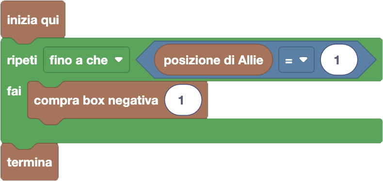

import { toolbox } from "./toolbox.ts";
import initialBlocks from "./initial-blocks.json";
import customBlocks from "./s4.blocks.yaml";
import testcases from "./testcases.py";
import Visualizer from "./visualizer.jsx";
import { Hint } from "~/utils/hint";

Allie Muschio ha deciso di iniziare a giocare a FarmCraft. Il gioco sembra abbastanza divertente,
ma ha un piccolo problema: Allie è ancora molto indietro nella graduatoria globale!
Potrebbe allenarsi per alzare il suo punteggio, ma Allie ha un piano migliore.

La graduatoria di FarmCraft contiene $N$ giocatori, con il giocatore in posizione $i$-esima a punteggio $P_i$.
Nello store del gioco, Allie ha visto che c'è la possibilità di comprare $N$ diverse _box negative_,
numerate da $1$ a $N$, ciascuna con lo stesso costo di $C$ carote. Comprando la box $i$-esima, Allie potrà
abbassare di $1$ punto il punteggio della persona che **in quel momento** sarà $i$-esima in graduatoria.
Ogni box può essere comprata un qualunque numero di volte. Dato che Allie è la più facoltosa della fattoria,
ha deciso di usare queste box per abbassare il punteggio di tutti gli altri sotto il proprio e diventare così
prima in graduatoria! Hai a disposizione questi blocchi:

- `N`: il numero di giocatori di FarmCraft.
- `posizione di Allie`: la posizione corrente di Allie in graduatoria.
- `punteggio del giocatore` $i$: il punteggio $P_i$ del giocatore che in questo momento è $i$-esimo in graduatoria.
- `costo delle box negative`: costo $C$ in carote delle box per abbassare i punteggi dei giocatori.
- `compra box negativa` $i$: paga la box negativa $i$-esima e abbassa di $1$ il punteggio del giocatore che al momento è $i$-esimo.
- `termina`: goditi la meritata vittoria.

Aiuta Allie a diventare prima in graduatoria spendendo meno possibile!

<Hint label="suggerimento 1">
  Hai molti blocchi a disposizione, ma non tutti sono davvero necessari per risolvere il problema.
  Sai capire quali ti servono davvero?
</Hint>

<Hint label="suggerimento 2">
  Quando dovrai smettere di comprare box? Quali box può convenire comprare, finché non è ora di fermarsi?
</Hint>

<Blockly
  toolbox={toolbox}
  customBlocks={customBlocks}
  initialBlocks={initialBlocks}
  testcases={testcases}
  visualizer={Visualizer}
/>

> Un possibile programma corretto è il seguente:
>
> 
>
> Secondo questo programma, Allie continua a comprare box negative finché non diventa prima in graduatoria.
> In ogni momento, ha senso comprare solo le box dei giocatori prima di lei in graduatoria, e qualunque
> di queste box compri non cambierà il risultato. Quindi in questa soluzione, per semplicità, Allie sceglie
> di comprare sempre la box che abbassa il punteggio del primo giocatore, che è sicuramente prima di lei.

Prima di passare alla prossima domanda, assicurati di aver risolto **tutti i livelli** di questa!