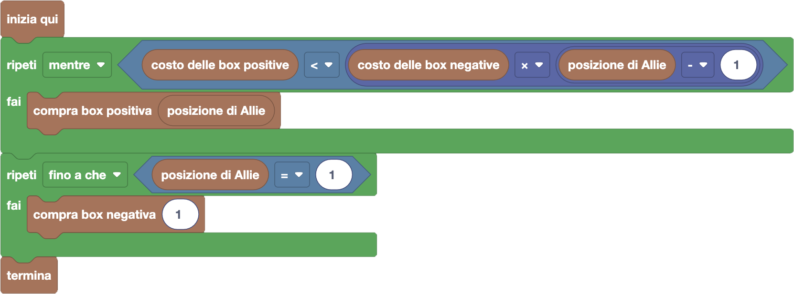

import { toolbox } from "./toolbox.ts";
import initialBlocks from "./initial-blocks.json";
import customBlocks from "./s5.blocks.yaml";
import testcases from "./testcases.py";
import Visualizer from "./visualizer.jsx";
import { Hint } from "~/utils/hint";

Poco dopo aver iniziato a comprare qualche box negativa, Allie si è accorta che in FarmCraft hanno messo in
vendita un nuovo tipo di box: le **box positive**! Comprando la box positiva $i$-esima, al costo di $K$ carote,
Allie potrà **alzare** di $1$ punto il punteggio della persona che **in quel momento** sarà $i$-esima in graduatoria.
Come prima, ogni box può essere comprata un qualunque numero di volte. Hai a disposizione questi blocchi:

- `N`: il numero di giocatori di FarmCraft.
- `posizione di Allie`: la posizione corrente di Allie in graduatoria.
- `punteggio del giocatore` $i$: il punteggio $P_i$ del giocatore che in questo momento è $i$-esimo in graduatoria.
- `costo delle box positive`: costo $K$ in carote delle box per alzare i punteggi dei giocatori **(nuovo!)**.
- `costo delle box negative`: costo $C$ in carote delle box per abbassare i punteggi dei giocatori.
- `compra box positiva` $i$: paga la box positiva $i$-esima e alza di $1$ il punteggio del giocatore che al momento è $i$-esimo **(nuovo!)**.
- `compra box negativa` $i$: paga la box negativa $i$-esima e abbassa di $1$ il punteggio del giocatore che al momento è $i$-esimo.
- `termina`: goditi la meritata vittoria.

Aiuta Allie a riprovare ad arrivare prima in graduatoria spendendo meno possibile!

<Hint label="suggerimento 1">
  Questa volta hai delle scelte da prendere, sempre in modo greedy: meglio una box positiva o negativa?
</Hint>

<Hint label="suggerimento 2">
  Se prendi una box positiva, quante box negative ti risparmia di prendere in futuro per arrivare primo?
</Hint>

<Hint label="suggerimento 3">
  Nella soluzione, conviene prima prendere tutte le box di un tipo (quale?) e poi tutte le box dell'altro,
  con due cicli "ripeti mentre/fino a che". Riesci a impostarli?
</Hint>

<Blockly
  toolbox={toolbox}
  customBlocks={customBlocks}
  initialBlocks={initialBlocks}
  testcases={testcases}
  visualizer={Visualizer}
/>

> Un possibile programma corretto è il seguente:
>
> 
>
> Innanzitutto, notiamo che comprare una box positiva per Allie è equivalente come effetto in graduatoria a
> comprare una box negativa per tutti i giocatori sopra di lei. La prima opzione (una box positiva) costa $K$,
> mentre la seconda opzione (tante box negative) costa $C \times (i-1)$ dove $i$ è la posizione attuale di Allie
> in graduatoria. Seguiamo quindi una strategia greedy, ogni volta scegliendo se usare una box positiva o negativa
> sulla base di quali di questi due numeri è più piccolo. Dato che il primo numero ($K$) è fisso mentre il
> secondo numero ($C \times (i-1)$) diminuisce man mano che Allie sale in graduatoria, la box positiva potrà
> essere conveniente solo inizialmente, e quando inizierà a non esserlo più converrà usare solo box negative.
>
> Il programma sopra realizza questa idea. Prima di tutto Allie continua a comprare la box positiva della sua
> posizione, fintanto che questa è conveniente (e quindi $K < C \times (i-1)$). Quando questo non è più vero,
> passa alla stessa strategia del problema precedente, comprando la box negativa del primo giocatore fino ad
> arrivare primi.

Prima di passare alla prossima domanda, assicurati di aver risolto **tutti i livelli** di questa!