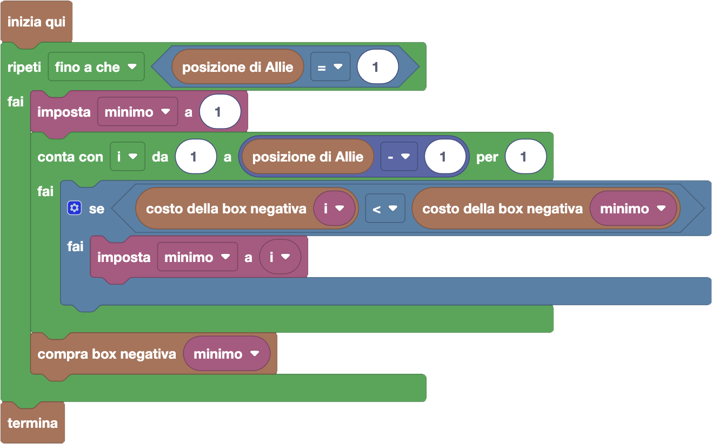

import { toolbox } from "./toolbox.ts";
import initialBlocks from "./initial-blocks.json";
import customBlocks from "./s6.blocks.yaml";
import testcases from "./testcases.py";
import Visualizer from "./visualizer.jsx";
import { Hint } from "~/utils/hint";

Prima che Allie riesca a comprare tutte le box che le servono per diventare prima in graduatoria, gli sviluppatori
di FarmCraft le hanno di nuovo cambiato le carte in tavola! Dopo alcune proteste sulla possibilità di comprare
punti con le box, hanno deciso di rimuovere dal mercato del gioco le box positive. Per compensare la perdita di
guadagni, hanno deciso invece di puntare maggiormente sulle box negative, facendo sì che abbiano **ciascuna un
costo diverso!**

In particolare, la box negativa $i$-esima, per abbassare il punteggio del giocare che in quel momento è $i$-esimo
in graduatoria, ha ora un costo di $C_i$ carote. Come sempre, ogni box può essere comprata un qualunque numero di
volte. Hai a disposizione questi blocchi:

- `N`: il numero di giocatori di FarmCraft.
- `posizione di Allie`: la posizione corrente di Allie in graduatoria.
- `punteggio del giocatore` $i$: il punteggio $P_i$ del giocatore che in questo momento è $i$-esimo in graduatoria.
- `costo della box negativa` $i$: costo $C_i$ in carote della box negativa $i$-esima **(nuovo!)**.
- `compra box negativa` $i$: paga la box negativa $i$-esima e abbassa di $1$ il punteggio del giocatore che al momento è $i$-esimo.
- `termina`: goditi la meritata vittoria.

Aiuta Allie ad arrivare finalmente prima una volta per tutte, sempre spendendo meno possibile!

<Hint label="suggerimento 1">
  Anche stavolta hai scelte da prendere in modo greedy: quale box negativa conviene comprare?
  Qual è la condizione in cui ti puoi fermare?
</Hint>

<Hint label="suggerimento 2">
  Per trovare la box migliore da prendere, il procedimento che ti serve ha delle parti in comune
  con la soluzione alla prima domanda di questa lezione.
</Hint>

<Blockly
  toolbox={toolbox}
  customBlocks={customBlocks}
  initialBlocks={initialBlocks}
  testcases={testcases}
  visualizer={Visualizer}
/>

> Un possibile programma corretto è il seguente:
>
> 
>
> Secondo questo programma, Allie continua a comprare box finché non diventa prima in graduatoria.
> Ogni volta, tra le box relative ai giocatori che stanno sopra di lei (che servono a qualcosa),
> sceglie sempre quella che ha il **costo minimo** (scelta greedy).
>
> Per trovare la box con il costo minimo, utilizziamo una variabile _minimo_.
> Consideriamo tutte le box $i$ da $1$ alla posizione prima di Allie tramite un ciclo contatore:
> se la box $i$-esima costa meno della box che abbiamo salvato in _minimo_, impostiamo il _minimo_ a $i$.
