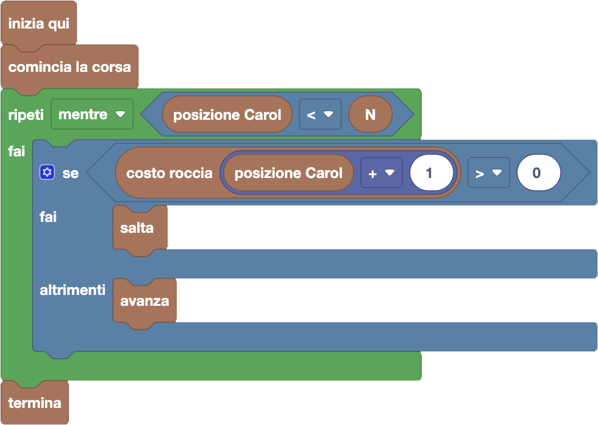

import { toolbox } from "./toolbox.ts";
import initialBlocks from "./initial-blocks.json";
import customBlocks from "./s1.blocks.yaml";
import testcases from "./testcases.py";
import Visualizer from "./visualizer.jsx";
import { Hint } from "~/utils/hint";

Carol, nota per la sua passione per la corsa ad ostacoli, sta iniziando un nuovo tipo di competizione:
la **corsa a pagamento**! Il funzionamento è simile a quello della corsa ad ostacoli, solo che invece
degli ostacoli (su cui non si può mai atterrare) ci sono alcune rocce marroni che sono _a pagamento_.
Carol può atterrare sulle rocce a pagamento, ma se lo fa dovrà pagare alcune carote di penalità alla
fine della corsa!

Il percorso è composto da $N$ rocce, numerate da $1$ a $N$, e la roccia $i$-esima ha un costo di $P_i$.
Carol comincia subito prima della prima roccia, e deve raggiungere o superare la bandierina finale
(sull'ultima roccia). In questa prima corsa, gli organizzatori sono stati attenti ad assicurarsi che
**non ci siano mai due rocce a pagamento di seguito**. Hai a disposizione questi blocchi:

- `N`: il numero di rocce del percorso.
- `posizione Carol`: la posizione corrente di Carol.
- `costo roccia` $i$: il costo $P_i$ in carote per atterrare sulla $i$-esima roccia del percorso (zero per le rocce gratis).
- `comincia la corsa`: comincia la corsa dalla posizione di partenza.
- `avanza`: avanza alla roccia successiva.
- `salta`: salta oltre alla prossima roccia, atterrando su quella dopo.
- `termina`: finisci la corsa e vai a pagare le penalità.

Aiuta Carol a completare il percorso pagando meno carote possibile!

<Hint>
  Quando cominci la corsa, ad ogni punto del percorso, devi scegliere tra avanzare e saltare.
  Come nella scorsa lezione, puoi scegliere cosa fare in modo greedy!
</Hint>

<Blockly
  toolbox={toolbox}
  customBlocks={customBlocks}
  initialBlocks={initialBlocks}
  testcases={testcases}
  visualizer={Visualizer}
/>

> Un possibile programma corretto è il seguente:
>
> 
>
> Secondo questo programma, Carol comincia subito la corsa dalla posizione di partenza.
> Poi, fino a che non raggiunge l'ultima roccia (in posizione $N$), procede saltando o avanzando.
> Se la roccia davanti a Carol è gratis, avanza; invece se è a pagamento la salta.
> Dato che non ci sono due rocce a pagamento vicine, Carol riuscirà in questo modo a raggiungere
> la fine del percorso senza pagare nessuna carota!

Prima di passare alla prossima domanda, assicurati di aver risolto **tutti i livelli** di questa!