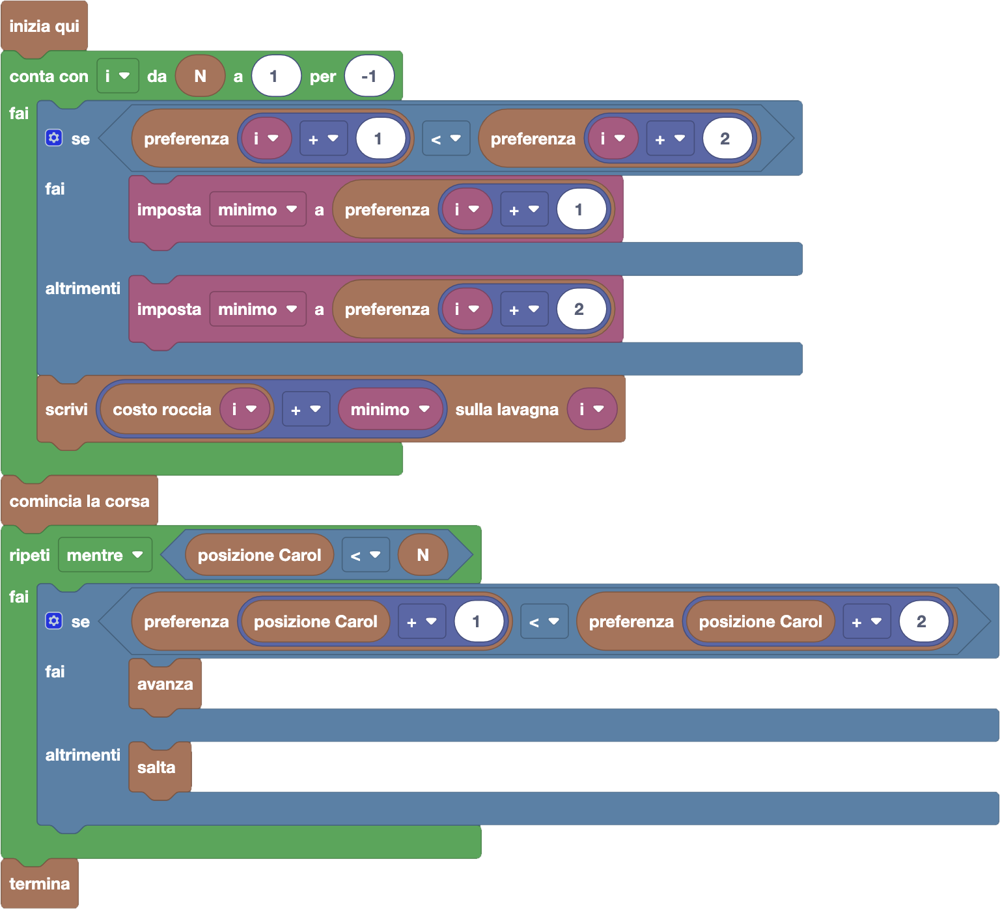

import { toolbox } from "./toolbox.ts";
import initialBlocks from "./initial-blocks.json";
import customBlocks from "./s2.blocks.yaml";
import testcases from "./testcases.py";
import Visualizer from "./visualizer.jsx";
import { Hint } from "~/utils/hint";

Carol vuole partecipare ad una nuova _corsa a pagamento_. Dato che con la prima corsa gli organizzatori
hanno guadagnato poco, hanno deciso che ora metteranno **solamente rocce a pagamento**!
In compenso, hanno messo una lavagna ad ogni posizione del percorso, su cui i partecipanti possono
annotare una loro **preferenza numerica** per ciascuna posizione **prima di cominciare la corsa**.
Hai a disposizione gli stessi blocchi di prima, più due nuovi per leggere e scrivere sulle lavagne:

- `N`: il numero di rocce del percorso.
- `posizione Carol`: la posizione corrente di Carol.
- `costo roccia` $i$: il costo $P_i$ in carote per atterrare sulla $i$-esima roccia del percorso (zero per le rocce gratis).
- `scrivi` $x$ `sulla lavagna` $i$: Carol scrive la preferenza $x$ sulla lavagna $i$-esima prima di cominciare la corsa **(nuovo!)**.
- `preferenza` $i$: il numero che Carol ha scritto sulla lavagna $i$-esima, <u>oppure zero se la lavagna </u>$i$<u>-esima non esiste</u> **(nuovo!)**.
- `comincia la corsa`: comincia la corsa dalla posizione di partenza.
- `avanza`: avanza alla roccia successiva.
- `salta`: salta oltre alla prossima roccia, atterrando su quella dopo.
- `termina`: finisci la corsa e vai a pagare le penalità.

Aiuta Carol a completare il percorso pagando meno carote possibile!

Questa volta scegliere tra avanzare e saltare in modo greedy (senza preoccuparsi del resto del percorso)
non ci farà pagare il meno possibile. _Se vuoi, ti invitiamo a provare e vedere come va!_ Fare meglio non
sarà facile, e per riuscirci avremo bisogno di usare prima le lavagne e annotarci le giuste preferenze
sopra ogni posizione. Poi, potremo scegliere tra avanzare e saltare basandoci sui numeri che abbiamo
scritto sulle lavagne.

<Hint label="suggerimento 1">
  Il valore di preferenza che scriveremo dovrà servire a guidarci nelle scelte, per cui potremo guardare
  la preferenza delle prossime rocce più vicine per capire se avanzare o saltare. Cosa dovrà quindi
  rappresentare questo valore di preferenza?
</Hint>

<Hint label="suggerimento 2">
  Per calcolare i valori di preferenza bisognerà utilizzare un ciclo contatore per scandire tutte le rocce.
  Conviene scandirle dall'inizio o dalla fine? Ti ricordiamo che per scandire in avanti nel ciclo contatore
  basta impostare che il ciclo proceda "per 1", mentre per scandire all'indietro bisogna indicare "per -1".
</Hint>

<Blockly
  toolbox={toolbox}
  customBlocks={customBlocks}
  initialBlocks={initialBlocks}
  testcases={testcases}
  visualizer={Visualizer}
/>

> Un possibile programma corretto è il seguente:
>
> 
>
> Secondo questo programma, prima di cominciare la corsa, scandiamo tutte le rocce dall'ultima tornando
> indietro verso la prima. Per ciascuna di essere, annotiamo un valore di preferenza sulla lavagna, che
> corrisponde a **quanto ci costa finire il percorso da quel punto in poi**. Ci viene anche in aiuto che
> il blocco `preferenza` $i$ restituisce zero per tutte le posizioni $i$ dopo la fine del percorso, che è
> proprio pari al costo (zero) che abbiamo da quel punto in poi (visto che lì abbiamo già finito).
>
> Per calcolare quindi la preferenza (cioè il costo per finire da una certa roccia in poi), dobbiamo
> trovare il minimo tra la preferenza delle due rocce successive (cioè i costi per finire da quelle rocce).
> Salviamo questo valore nella variabile _minimo_, e da questo otteniamo la preferenza della roccia
> corrente aggiungendoci il suo costo.
>
> Al termine di questo ciclo, avremo compilato le preferenze su tutte le lavagne, e quindi possiamo
> procedere in modo simile al problema precedente. Cominciamo quindi la corsa dalla posizione di partenza,
> poi procediamo saltando o avanzando fino a che non abbiamo raggiunto o superato l'ultima roccia.
> Avanziamo se la preferenza della prossima roccia è minore di quella della roccia successiva, altrimenti
> saltiamo. In questo modo andremo a spendere esattamente il numero minimo di carote per raggiungere la
> fine del percorso!

Prima di passare alla prossima domanda, assicurati di aver risolto **tutti i livelli** di questa!

**(lezione in costruzione, continua...)**