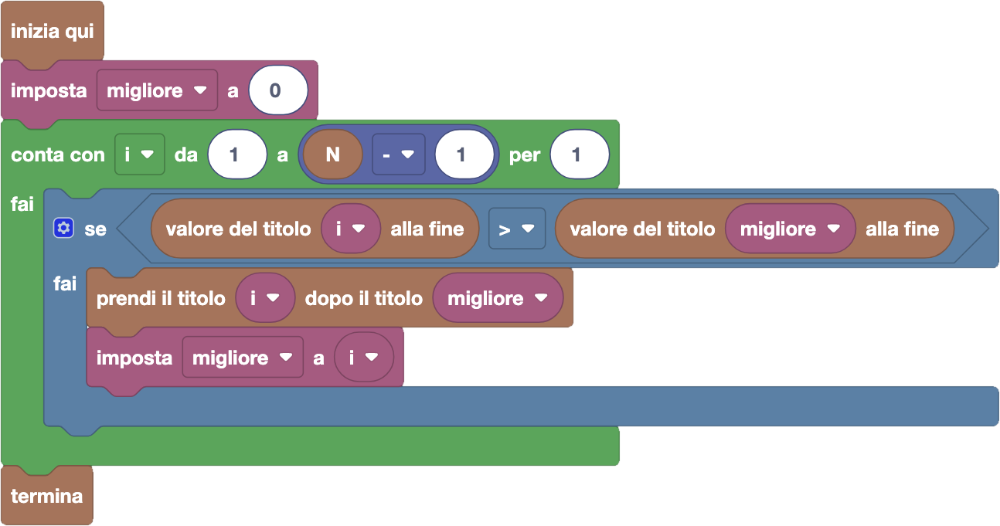

import { toolbox } from "./toolbox.ts";
import initialBlocks from "./initial-blocks.json";
import customBlocks from "./s3.blocks";
import testcases from "./testcases.py";
import Visualizer from "./visualizer";
import { Hint } from "~/utils/hint";

Per il suo compleanno, a Tip-Tap hanno regalato un titolo di investimento della **Carrot**!
Per legge, quando vengono comprati i titoli di investimento hanno tutti un valore fisso di $10$ carote.
Inoltre, ogni titolo ha una sua rendita $G$: il suo valore sale quindi di $G$ carote ogni giorno,
per cui dopo $k$ giorni vale $10 + k \times G$. In particolare, il titolo della Carrot ha una rendita di 1 carota al giorno.

Il nostro amico vuole darsi alla finanza, anche se le leggi sulla finanza per i conigli sono molto restrittive.
Ogni giorno è disponibile un singolo titolo: nel giorno $i$, un titolo con rendita di $G_i$.
Inoltre, Tip-Tap non può mai possedere più titoli: se ha già un titolo, può solo scambiarlo
con quello del giorno corrente se vuole farlo, ma **senza ricevere nessuna rendita**.
La rendita può ottenerla solo rivendendo il titolo, cosa che potrà fare solo dopo $N$ giorni.

Tip-Tap è riuscito a scoprire quali titoli saranno disponibili per i prossimi $N-1$ giorni.
Usa queste informazioni per assicurarti il massimo guadagno alla fine!

Hai a disposizione questi blocchi per ispezionare la situazione:

- `N`: il numero di giorni dopo cui riceverai la rendita.
- `guadagno del titolo `$i$: il guadagno $G_i$ che avrà il titolo $i$-esimo in ogni giorno successivo.
- `valore del titolo `$i$` alla fine`: il valore del titolo proposto nel giorno $i$, aumentato di $G_i$ per ogni giorno fino all'$N$-esimo ($10 + (N-i) \cdot G_i$).

Inoltre, hai a disposizione questi blocchi per riportare un piano finanziario:

- `prendi il titolo` $~k~$ `dopo il titolo` $~i$: pianifica di prendere il titolo $k$ come prossimo titolo dopo $i$ (se prenderai il titolo $i$).
- `non prendere altri titoli dopo `$i$: pianifica di tenere il titolo $i$ fino alla fine degli $N$ giorni (e questo è il piano iniziale per tutti i titoli).
- `termina`: segui il piano che hai indicato con i blocchi fino alla fine degli $N$ giorni.

**Attenzione:** il titolo della Carrot è il numero _zero_, ed è possibile cambiare idea più volte
su quale titolo prendere dopo un certo titolo $i$ (e se prenderne o no), usando più volte i blocchi relativi.
Inoltre, il tuo piano può pianificare un _prossimo titolo_ anche per titoli che in realtà non verranno poi presi!

Se hai dei dubbi, prova a sperimentare il funzionamento della pianificazione titoli risolvendo il primo livello "a mano"
prima di cercare una soluzione generale.

<Hint>
  Ogni giorno, devi decidere se ti conviene tenere il titolo che hai oppure scambiarlo con quello del giorno.

  Come nella scorsa lezione, puoi scegliere cosa fare in modo greedy!
</Hint>

<Blockly
  toolbox={toolbox}
  customBlocks={customBlocks}
  initialBlocks={initialBlocks}
  testcases={testcases}
  visualizer={Visualizer}
/>

> Un possibile programma corretto è il seguente:
>
> 
>
> Secondo questo programma, scandiamo i titoli dal primo all'ultimo, andando a cercare quello che ci può dare il guadagno migliore.
> Creiamo quindi una variabile `migliore` per segnarci il titolo migliore trovato finora,
> impostandola all'inizio al titolo della Carrot (numero zero).
> Mentre che scandiamo i titoli, vediamo se il titolo corrente ci può dare un guadagno migliore alla fine dei giorni.
> Se sì, scambiamo il titolo preso finora con quello e lo impostiamo come nuovo titolo migliore.

Prima di passare alla prossima domanda, assicurati di aver risolto **tutti i livelli** di questa!