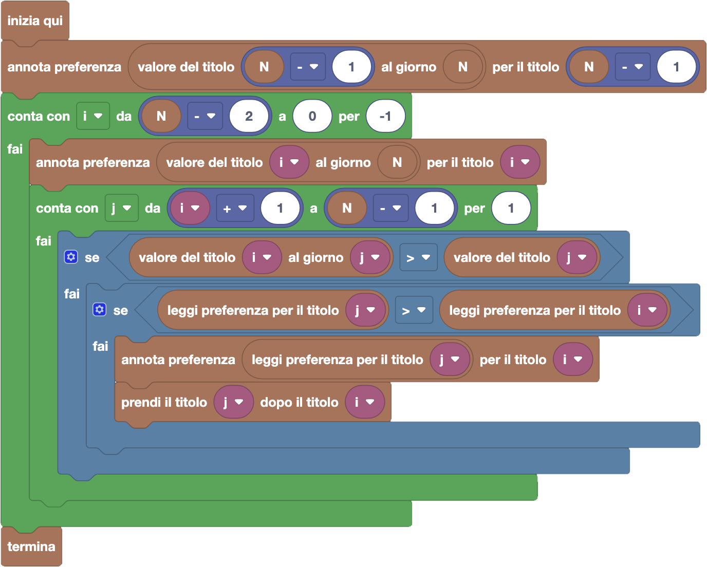

import { toolbox } from "./toolbox.ts";
import initialBlocks from "./initial-blocks.json";
import customBlocks from "./s4.blocks.yaml";
import testcases from "./testcases.py";
import Visualizer from "./visualizer.jsx";
import { Hint } from "~/utils/hint";

Dopo la prima stagione di investimenti, il governo ha deciso di liberalizzare in parte la finanza per i conigli!
I titoli ora non devono avere tutti il valore iniziale di 10 carote: il titolo del giorno $i$-esimo avrà quindi un suo valore $T_i$.
Tip-Tap inizia la stagione di nuovo con un titolo della Carrot, che stavolta inizia da un valore di $T_0$ carote e ha una rendita di $G_0$ carote,
per cui tra $k$ giorni varrà $T_0 + k \cdot G_0$.

La compravendita di titoli funziona come prima con un'unica differenza: Tip-Tap ora può scambiare il titolo che correntemente possiede con quello del giorno
soltanto se in quel giorno il titolo che ha vale più di quello del giorno. Solo in quel caso Tip-Tap può decidere di scambiare il
titolo che ha con quello offerto, ma sempre senza ricevere nessun resto in cambio.

Hai a disposizione questi blocchi per ispezionare la situazione:

- `N`: il numero di giorni.
- `valore del titolo` $i$: il valore $T_i$ del titolo che viene proposto nel giorno $i$ **(nuovo!)**.
- `guadagno del titolo` $i$: il guadagno $G_i$ che avrà il titolo $i$-esimo in ogni giorno successivo.
- `valore del titolo` $i$ `al giorno` $d$: il valore $T_i$ del titolo proposto nel giorno $i$, incrementato di $G_i$ al giorno fino al giorno $d$ ($T_i + (d-i) \cdot G_i$) **(nuovo!)**.

Inoltre, hai a disposizione questi blocchi per annotarti informazioni di supporto:

- `annota preferenza` $x$ `per il titolo` $i$: annota un numero $x$ a tua scelta sul titolo $i$-esimo **(nuovo!)**.
- `leggi preferenza per il titolo` $i$: leggi il numero che hai annotato sul titolo $i$-esimo **(nuovo!)**.

Infine, hai a disposizione gli stessi blocchi di prima per riportare un piano finanziario:

- `prendi il titolo` $k$ `dopo il titolo` $i$: pianifica di prendere il titolo $k$ come prossimo titolo dopo $i$ (se prenderai il titolo $i$).
- `non prendere altri titoli dopo` $i$: pianifica di tenere il titolo $i$ fino alla fine degli $N$ giorni (e questo è il piano iniziale per tutti i titoli).
- `termina`: segui il piano che hai indicato con i blocchi fino alla fine degli $N$ giorni.

Se hai dei dubbi, prova a sperimentare il funzionamento della pianificazione titoli risolvendo il primo livello "a mano" prima di cercare una soluzione generale.

<Hint label="suggerimento 1">
  Il valore di preferenza che scriveremo dovrà servire a guidarci nelle scelte, per cui potremo guardare
  la preferenza già calcolata per altri titoli per capire cosa conviene fare. Cosa dovrà quindi
  rappresentare questo valore di preferenza?
</Hint>

<Hint label="suggerimento 2">
  Per calcolare i valori di preferenza bisognerà utilizzare un ciclo contatore per scandire tutti i titoli.
  Conviene scandirli dall'inizio o dalla fine? Ti ricordiamo che per scandire in avanti nel ciclo contatore
  basta impostare che il ciclo proceda "per 1", mentre per scandire all'indietro bisogna indicare "per -1".
</Hint>

<Hint label="suggerimento 3">
  In un solo ciclo contatore, puoi annotare il valore di preferenza del titolo $i$-esimo
  e scegliere cosa prendere dopo il titolo $i$-esimo. Considera sempre la possibilità
  che quel titolo sia l'ultimo. Poi, per capire se puoi fare di meglio, dovrai esaminare
  tutti i titoli che potresti prendere dopo di lui, e decidere quale sarebbe il migliore.
</Hint>

<Blockly
  toolbox={toolbox}
  customBlocks={customBlocks}
  initialBlocks={initialBlocks}
  testcases={testcases}
  visualizer={Visualizer}
/>

> L'idea principale che serve a risolvere il problema è capire cosa annotare sui titoli. Supponiamo
> di annotare su ogni titolo un numero che rappresenta **quanto al massimo potremmo avere all'ultimo giorno**,
> **se prenderemo questo titolo e poi faremo le scelte migliori possibili**.
> Con questa idea, un possibile programma corretto è il seguente:
>
> 
>
> Secondo questo programma, scandiamo i titoli dall'ultimo all'indietro dall'ultimo fino al primo, per capire
> cosa possiamo annotarci sopra (e quale "freccia" mettere). Per l'ultimo ci sono poche scelte: dovremo per
> forza tenerlo, quindi non mettiamo frecce e annotiamo il valore che acquisisce all'ultimo giorno.
>
> Per gli altri titoli $i$, iniziamo comunque allo stesso modo, considerando cosa possiamo ottenere se li tenessimo
> fino alla fine, quindi annotando il valore che acquisirebbero all'ultimo giorno. Poi, però, dobbiamo consideriare
> se ad un certo punto ci potrebbe convenire scambiarli con un altro titolo!
>
> Iteriamo quindi sui titoli $j$ successivi, verificando prima se lo scambio ci verrebbe accettato dall'intermediario,
> e poi se lo scambio ci porterebbe vantaggio. Possiamo facilmente capire se ci porta vantaggio, andando a leggere
> l'annotazione che su quel titolo avremo già messo, e che ci dice quanto al massimo potremo fare dal titolo $j$
> in poi! Se questa è meglio di quello che abbiamo trovato finora per il titolo $i$, e lo scambio è accettabile,
> ipotizziamo di fare lo scambio: aggiorniamo quindi l'annotazione per $i$ e programmiamo di prendere $j$ dopo $i$.
>
> Ripetendo questo procedimento per tutti i titoli, andiamo a costruire il piano di investimento migliore!

Prima di passare alla prossima domanda, assicurati di aver risolto **tutti i livelli** di questa!

**(lezione in costruzione, continua...)**