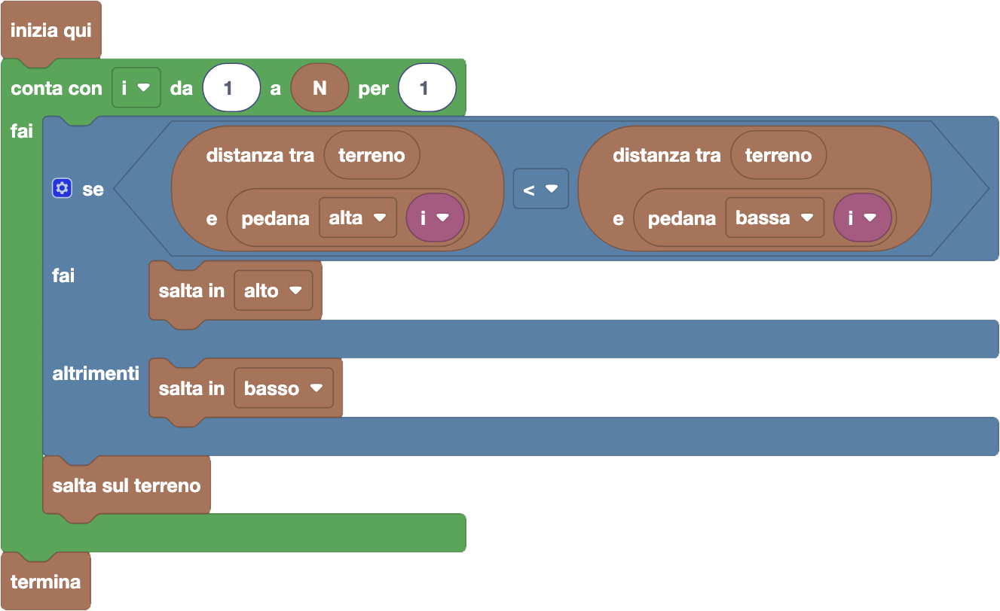

import { toolbox } from "./toolbox.ts";
import initialBlocks from "./initial-blocks.json";
import customBlocks from "./s5.blocks.yaml";
import testcases from "./testcases.py";
import Visualizer from "./visualizer.jsx";
import { Hint } from "~/utils/hint";

Il nuovissimo videogioco _SuperBunny_ è finalmente in commercio!
In ogni livello Bunny, il protagonista del videogioco, deve superare $N$ fossati numerati da $1$ ad $N$.
In ogni fossato sono sospese $2$ pedane (ad altezze diverse) su cui Bunny può saltare: per il fossato numero $i$,
hai a disposizione una pedana più in alto che si trova ad una altezza di $A_i$ metri, e da una pedana più in basso ad un'altezza di $B_i$ metri.

Bunny parte dall'altezza del terreno e deve per prima cosa saltare su una delle due pedane del fossato numero $1$, per poi saltare di nuovo sul
tratto di terreno successivo (che è sempre alla stessa altezza). L'obiettivo del gioco è superare in ordine tutti gli $N$ fossati.
Anche se Bunny può scegliere ogni volta su quale pedana di un fossato saltare, non tutti i salti sono uguali: più il salto è grande e più tempo ci vuole per farlo.
Per saltare tra il terreno ad altezza $k$ e una pedana ad altezza $h$, Bunny ci metterà una quantità di secondi pari alla **distanza** tra $h$ e $k$.

_**Nota:** la distanza tra i numeri $h$ e $k$ è pari alla differenza tra $h$ e $k$ ignorando il segno: quindi $h - k$ se $h > k$ o $k - h$ se $k > h$._

Il tempo totale impiegato per completare un livello è la somma dei tempi impiegati in ogni salto.

Hai a disposizione questi blocchi per ispezionare la situazione:

- `N`: il numero $N$ di fossati.
- `terreno`: l'altezza di tutti i tratti di terreno.
- `pedana alta/bassa i`: l'altezza $A_i$ (risp. $B_i$) della $i$-esima pedana alta (risp. in bassa).
- `distanza tra x e y`: la distanza tra due numeri $x$ e $y$.

Inoltre, hai a disposizione questi blocchi per muoverti nel livello:

- `salta in alto/basso`: salta sulla prossima pedana in alto/basso.
- `salta sul terreno`: salta da una pedana sul prossimo tratto di terreno.
- `termina`: concludi il livello.

Aiuta a Bunny a completare il livello in meno tempo possibile!

**Nota:** nei blocchi "salta in alto" non vuol dire per forza che il coniglio finisca ad un'altezza più alta, ma solo che salta sulla **prossima pedana in alto**
(ma che potrebbe comunque essere più bassa della posizione corrente). Stessa cosa per "salta in basso", che può portare Bunny più in alto di dove si trova ora.

<Hint>
  A ogni fossato, devi decidere saltare in alto o in basso.

  Come nella scorsa lezione, puoi scegliere cosa ti conviene fare in modo greedy!
</Hint>

<Blockly
  toolbox={toolbox}
  customBlocks={customBlocks}
  initialBlocks={initialBlocks}
  testcases={testcases}
  visualizer={Visualizer}
/>

> Un possibile programma corretto è il seguente:
>
> 
>
> In questo programma, a ogni fossato devi scegliere se saltare in alto o in basso.
> Puoi farlo semplicemente guardando se la piattaforma in alto è più vicina al terreno rispetto alla piattaforma in basso.

Prima di passare alla prossima domanda, assicurati di aver risolto **tutti i livelli** di questa!
