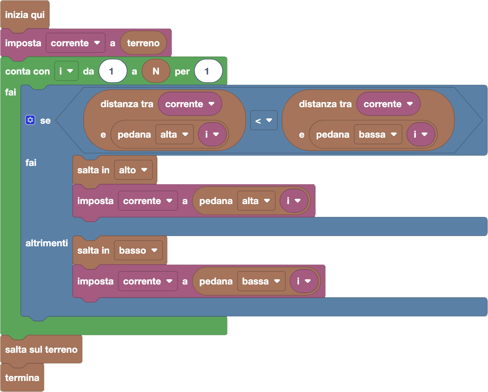
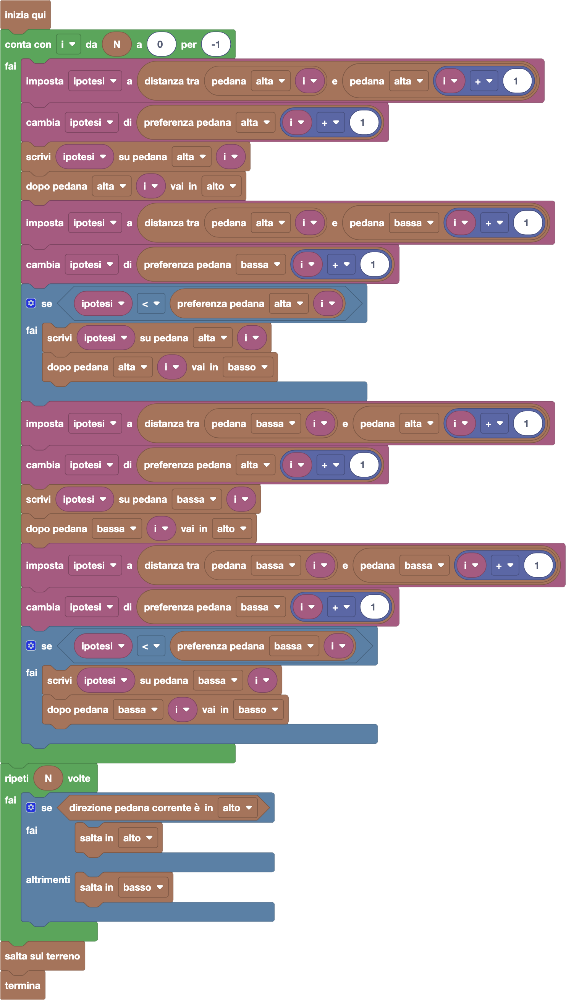

import { toolbox } from "./toolbox.ts";
import initialBlocks from "./initial-blocks.json";
import customBlocks from "./s6.blocks.yaml";
import testcases from "./testcases.py";
import Visualizer from "./visualizer.jsx";
import { Hint } from "~/utils/hint";

Dopo il grande successo di _SuperBunny_ è stato rilasciato un sequel: _IperBunny_!
Questo videogioco è quasi uguale, tranne che c'è un unico grande fossato. In questo fossato sono disposti $N$ pali con due pedane (alta e bassa)
uno dopo l'altro. Bunny deve quindi saltare da una pedana ad una successiva, senza passare dall'altezza del terreno.
Come prima, Bunny può scegliere su quale pedana di un palo saltare, e il tempo richiesto per un salto è dato dalla distanza tra le due pedane.
Il tempo totale impiegato per completare un livello è la somma dei tempi impiegati in ogni salto.

Hai a disposizione gli stessi blocchi di prima per ispezionare la situazione:

- `N`: il numero $N$ di fossati.
- `terreno`: l'altezza di tutti i tratti di terreno.
- `pedana alta/bassa i`: l'altezza $A_i$ (risp. $B_i$) della $i$-esima pedana alta (risp. in bassa).
- `distanza tra x e y`: la distanza tra due numeri $x$ e $y$.

In aggiunta, hai questi nuovi blocchi per scrivere e leggere informazioni sulle pedane:

- `preferenza pedana alta/bassa i`: il valore scritto sulla pedana alta/bassa $i$-esima **(nuovo!)**.
- `scrivi x su pedana alta/bassa i`: scrivi sulla pedana alta/bassa $i$-esima il valore $x$ **(nuovo!)**.
- `direzione pedana corrente è in alto/basso`: vero se la la direzione decisa per la pedana corrente è in alto/basso **(nuovo!)**.
- `dopo pedana alta/bassa i vai in alto/basso`: decidi una direzione in alto/basso da prendere dopo la pedana alta/bassa $i$-esima **(nuovo!)**.

Infine, hai a disposizione gli stessi blocchi di prima per muoverti nel livello:

- `salta in alto/basso`: salta sulla prossima pedana in alto/basso.
- `salta sul terreno`: salta da una pedana sul prossimo tratto di terreno.
- `termina`: concludi il livello.

Aiuta a Bunny a completare il livello in meno tempo possibile!

**Attenzione:** per comodità, tutti i blocchi riguardo alle pedane possono essere usati anche sul tratto di terreno iniziale (come se fosse la pedana zero)
e sul tratto di terreno finale (come se fosse la pedana $N+1$).

<Hint label="suggerimento 1">
  Il valore di preferenza che scriveremo dovrà servire a guidarci nelle scelte, per cui potremo guardare
  la preferenza già calcolata per altre pedane per capire cosa conviene fare. Cosa dovrà quindi
  rappresentare questo valore di preferenza?
</Hint>

<Hint label="suggerimento 2">
  Per calcolare i valori di preferenza bisognerà utilizzare un ciclo contatore per scandire tutte le pedane.
  Conviene scandirle dall'inizio o dalla fine? Ti ricordiamo che per scandire in avanti nel ciclo contatore
  basta impostare che il ciclo proceda "per 1", mentre per scandire all'indietro bisogna indicare "per -1".
</Hint>

<Hint label="suggerimento 3">
  In un solo ciclo contatore, puoi annotare il valore di preferenza delle pedane alta e bassa $i$-esime,
  e scegliere anche la direzione per le stesse pedane. La direzione potrai poi usarla per seguire la
  strategia migliore alla fine!
</Hint>

<Blockly
  toolbox={toolbox}
  customBlocks={customBlocks}
  initialBlocks={initialBlocks}
  testcases={testcases}
  visualizer={Visualizer}
/>

> Se siamo abituati a pensare in modo greedy, una cosa che ci può venire in mente di fare è questa:
> per ogni punto in cui ci troviamo, decidiamo di saltare in alto se la pedana in alto è più vicina
> della pedana in basso, altrimenti saltiamo in basso.
>
> 
>
> Questo procedimento, però, non sempre ci porta al risultato migliore: a volte conviene fare un salto
> più lungo, che però ci consente di fare un percorso più veloce in seguito. Non possiamo scegliere sul
> momento senza preoccuparci delle conseguenze: dobbiamo sfruttare i nuovi blocchi!
>
> L'idea principale che serve a risolvere il problema è quindi capire cosa scrivere sulle pedane. Supponiamo
> di scrivere su ogni pedana un numero che rappresenta **in quanto tempo possiamo finire il livello da lì**.
> Con questa idea, un possibile programma corretto è il seguente:
>
> 
>
> In questo programma, iteriamo sulle pedane dall'ultima verso la prima. Sfruttiamo anche che sul terreno
> finale abbiamo già scritto zero, che è in effetti il tempo che manca da lì. Per le altre pedane (alte
> o basse), consideriamo prima l'ipotesi di saltare in alto. Salviamo quindi nella variabile `ipotesi`
> la durata del salto che dovremmo fare, incrementata del valore scritto sulla pedana su cui arriveremmo.
> Sulla pedana ci segnamo il valore finale ottenuto per l'ipotesi, e la direzione che stiamo considerando (in alto).
> A questo punto, consideriamo anche l'ipotesi di saltare in basso. Come prima, salviamo nella variabile
> `ipotesi` la durata del salto che dovremmo fare incrementata del valore scritto sulla pedana su cui arriveremmo.
> Ora confrontiamo la nuova ipotesi (di saltare in basso) con quella già scritta sulla pedana (di saltare in alto):
> se la nuova ipotesi ci fa risparmiare tempo, cambiamo la scritta sulla pedana con la nuova ipotesi e ci
> segnamo di proseguire poi in basso.
>
> Una volta che abbiamo finito di segnarci tutto, per fare la strada migliore
> basterà seguire le direzioni che ci siamo segnati fino alla fine del percorso!
