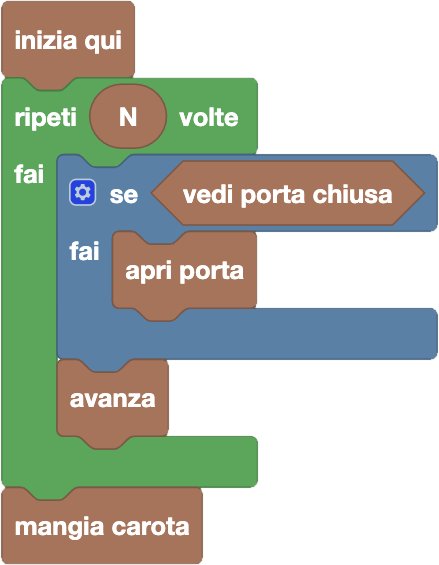

import initialBlocks from "./initialBlocks.json";
import customBlocks from "./customBlocks.yaml";
import testcases from "./testcases.py";
import Visualizer from "./visualizer.jsx";

Tip-Tap vorrebbe tanto mangiare la sua carota, prima però deve raggiungerla!
A separarlo dal suo obiettivo ci sono $N$ rocce, alcune divise da porte chiuse.
Tip-Tap sa compiere le seguenti azioni:

- `avanza`: salta alla roccia più vicina a destra, solo se non c'è una porta chiusa in mezzo.
- `vedi porta`: condizione vera se di fianco a te c'è una porta chiusa.
- `apri porta`: apri la porta a destra, ma solo se è di fianco a te.
- `mangia carota`: mangia la carota a destra (solo se è di fianco a te) e termina il programma.

Scrivi un programma che consenta a Tip-Tap di mangiare sempre la carota!

<Blockly
  customBlocks={customBlocks}
  initialBlocks={initialBlocks}
  testcases={testcases}
  debug={{ logBlocks: false, logJs: false, logVariables: false }}
  Visualizer={Visualizer}
/>

> Un possibile programma corretto è il seguente:
>
> 
>
> Secondo questo programma, per ognuno degli $N$ passi che Tip-Tap deve fare, il protagonista
> controlla innanzitutto se vede una porta chiusa. Se la vede, allora la apre; e poi in ogni caso
> avanza alla roccia successiva. Completati tutti gli $N$ passi, Tip-Tap procede quindi a mangiare la carota.
