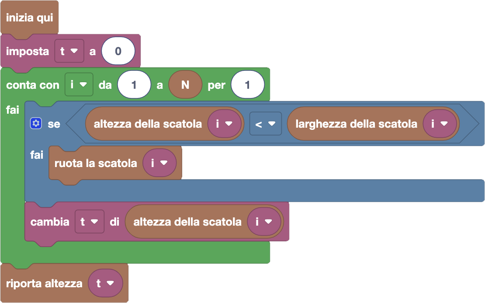

import initialBlocks from "./initialBlocks.json";
import customBlocks from "./s2.blocks.yaml";
import testcases from "./testcases.py";
import Visualizer from "./visualizer.jsx";

Bunny e i suoi amici stanno cercando gli ovetti di pasqua nascosti in giro per la fattoria Fibonacci!
Bunny è convinto che ci siano ovetti nascosti anche sui tetti, quindi ha deciso di costruire una
torre che gli consenta di arrivare più in alto possibile.

Per farlo, ha impilato $N$ scatole rettangolari di varie dimensioni. Bunny può misurare queste dimensioni,
tramite le operazioni:

- `altezza della scatola i`: l'altezza della $i$-esima scatola.
- `larghezza della scatola i`: la larghezza della $i$-esima scatola.

Tuttavia, Bunny non è convinto di aver realizzato la torre più alta che potrebbe fare. Per aggiustare
la torre, Bunny può fare la seguente operazione:

- `ruota la scatola i`: ruota di 90 gradi la scatola $i$-esima, scambiando quindi di conseguenza
  la sua altezza con la sua larghezza.

Aiuta Bunny a realizzare la torre più alta! Aiutalo anche a capire per quali tetti la torre sarà
abbastanza alta, riportando l'altezza totale della torre con l'operazione:

- `riporta altezza t`: termina il programma riportando il numero $t$ come altezza della torre.

<Blockly
  customBlocks={customBlocks}
  initialBlocks={initialBlocks}
  testcases={testcases}
  debug={{ logBlocks: false, logJs: false, logVariables: false }}
  visualizer={Visualizer}
/>

> Un possibile programma corretto è il seguente:
>
> 
>
> In questo programma, dopo aver inizializzato la variabile $t$ a zero, Bunny itera sulle $N$ scatole,
> numerandole tramite la variabile $i$ che cresce da $1$ a $N$ a ogni iterazione. In ciascun passo,
> controlla se l'altezza della scatola $i$-esima è minore della sua larghezza: in questo caso, conviene
> ruotarla per alzare la torre. Volendo inoltre calcolare l'altezza totale della torre, Bunny aggiunge
> l'altezza della scatola (possibilmente ruotata) alla variabile $t$. Una volta terminato di esaminare
> tutte le scatole, Bunny può terminare riportando il valore di $t$ come altezza della torre.
