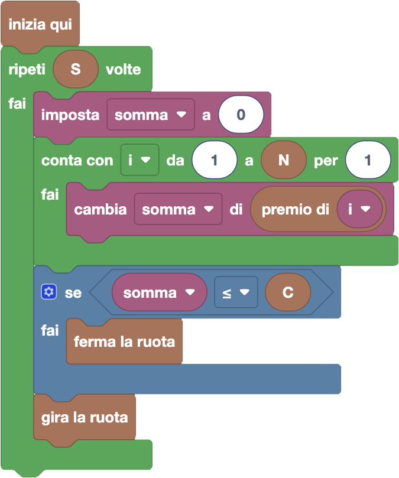

import customBlocks from "./customBlocks.yaml";
import initialBlocks from "./initialBlocks.json";
import testcases from "./testcases.py";
import Visualizer from "./visualizer.jsx";

Tip-Tap ha appena raccolto ben $C$ carote dal suo orto, e vuole condividerle con i suoi $N$ amici.
Li ha quindi invitati tutti a giocare alla ruota della fortuna, per decidere come dividerle divertendosi!

La ruota della fortuna è un cerchio diviso in $S$ spicchi, e su ciascuno di essi c'è scritto un numero.
Tutti i giocatori si siedono intorno alla ruota davanti a uno spicchio e poi la ruota viene fatta girare:
quando la ruota si ferma, ognuno otterrà tante carote quanto è il numero scritto sullo spicchio che a
quel punto avrà davanti a sé.

Ora gli amici sono arrivati, ma Tip-Tap si è reso conto di non aver fatto bene i conti: potrebbe non avere
abbastanza carote per pagare i premi! Per non fare brutta figura con gli amici, decide quindi di far girare
lentamente la ruota e poi fermarla di nascosto non appena si trova in una posizione in cui ha abbastanza
carote per tutti. Per farlo, Tip-Tap può fare le seguenti azioni:

- `gira la ruota`: lascia girare la ruota di un ulteriore spicchio.
- `premio di i`: quante carote riceverebbe al momento l'$i$-esimo amico.
- `ferma la ruota`: ferma la ruota e termina il programma.

Aiuta Tip-Tap, facendo girare la ruota fino a che non raggiunge la prima posizione per cui Tip-Tap
ha abbastanza carote per pagare tutti i premi!

_**Attenzione:** c'è sempre almeno una posizione della ruota che consente a Tip-Tap di pagare tutti i premi._

<Blockly
  customBlocks={customBlocks}
  initialBlocks={initialBlocks}
  testcases={testcases}
  debug={{ logBlocks: false, logJs: false, logVariables: false }}
  Visualizer={Visualizer}
/>

> Un possibile programma corretto è il seguente:
>
> 
>
> In questo programma, Tip-Tap prova a far girare la ruota fino ad un massimo di $S$ volte, provando quindi
> tutte le rotazioni possibili. Per ogni rotazione, calcola il premio totale da assegnare ai suoi amici
> nella variabile **somma**, inizializzandola a zero e poi iterando su tutti gli $N$ amici, ogni volta
> incrementando **somma** del valore del premio per l'amico $i$-esimo in questa rotazione. Se la somma
> così calcolata risulta minore del numero di carote a disposizione, Tip-Tap ferma la ruota, altrimenti
> lascia che la ruota continui a girare e continua a provare la prossima rotazione.
