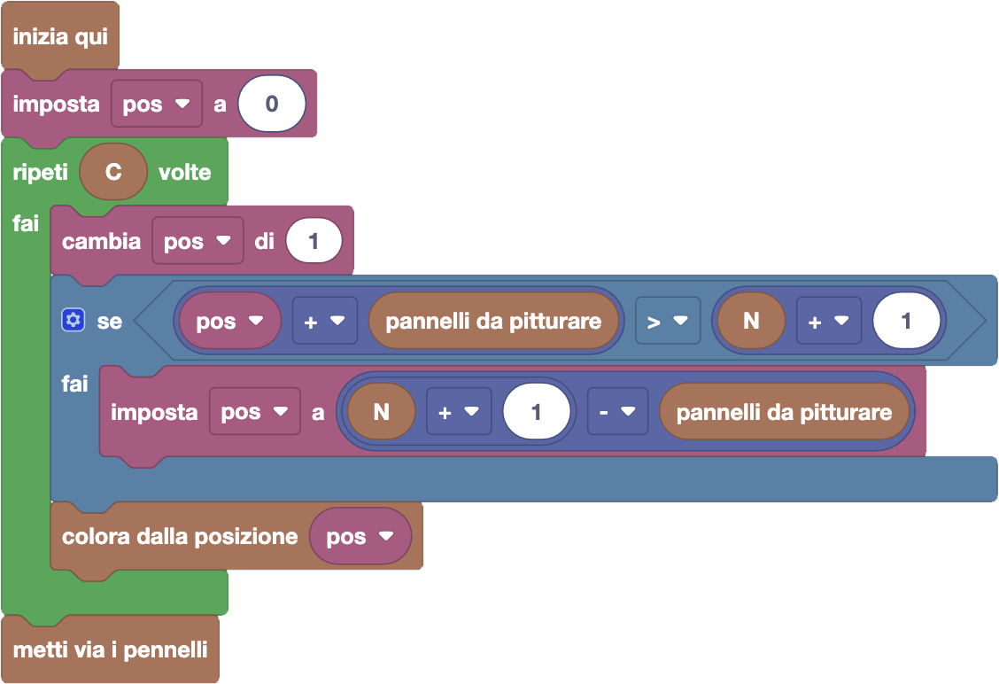

import initialBlocks from "./initialBlocks.json";
import customBlocks from "./customBlocks.yaml";
import testcases from "./testcases.py";
import Visualizer from "./visualizer.jsx";

Bunny ha comprato $C$ colori diversi per dipingere il muro della fattoria, che è composto
da $N$ pannelli verticali. L'obiettivo di Bunny è di dipingere il muro in zone rettangolari
che seguono i pannelli con la supervisione di Carol, l'artista della fattoria.

Bunny utilizzerà un colore alla volta nell'ordine che gli viene dato da Carol. Inoltre, Carol
sa quali colori sono i più belli, e quindi vuole che il colore $i$-esimo sia utilizzato per
dipingere un rettangolo largo $L_i$ pannelli.

Bunny è però libero di scegliere dove posizionare ogni rettangolo nel muro, e cioè da quale
pannello cominciare a dipingere, a patto di non dipingere oltre i bordi del muro.
Attenzione che Bunny può anche dipingere sopra i vecchi colori!

A Bunny piacciono le pareti colorate, e quindi vorrebbe che alla fine del lavoro rimangano
visibili sul muro più colori possibile (senza considerare il bianco iniziale del muro).
Aiutalo a raggiungere il suo scopo, rispettando però le indicazioni di Carol!

Bunny può fare le seguenti azioni:

- `pannelli da pitturare`: quanti pannelli $L_i$ sono da pitturare con il colore corrente $i$ secondo Carol.
- `colora dalla posizione p`: usa il colore corrente $i$ per pitturare completamente $L_i$
  pannelli, a partire dal pannello $p$-esimo in poi, poi passa al prossimo colore. Attenzione che devono esistere almeno $L_i$
  pannelli nel muro a partire dal $p$-esimo!
- `metti via i pennelli`: finisce di pitturare e termina il programma.

Aiuta Bunny a pitturare di modo da lasciare più colori possibile alla fine del lavoro!

<Blockly
  customBlocks={customBlocks}
  initialBlocks={initialBlocks}
  testcases={testcases}
  debug={{ logBlocks: false, logJs: false, logVariables: false }}
  Visualizer={Visualizer}
/>

> Un possibile programma corretto è il seguente:
>
> 
>
> In questo programma, Bunny per avere più colori possibile sfrutta un'idea: far sì che tutti i colori dall'inizio
> fino alla sua posizione siano tutti diversi. Per ogni colore, prova quindi ad iniziare a colorare dalla posizione
> **pos** che è subito dopo alla posizione da cui ha colorato precedentemente, incrementando quindi **pos** di $1$
> _(all'inizio, parte a colorare dalla prima posizione)_. Tuttavia, potrebbe essere che Carol gli chieda di pitturare
> più pannelli di quelli che sono disponibili dalla posizione **pos** in avanti: questo succede se **pos** sommato ai
> pannelli da pitturare supera $N+1$. In questo caso, Bunny è costretto a cancellare alcuni dei colori che ha già
> usato: torna quindi indietro il meno possibile, finché non ha abbastanza spazio per pitturare il numero di pannelli
> che gli è stato richiesto. Dopo aver ripetuto questo procedimento per tutti i colori, Bunny può mettere via i pennelli.
