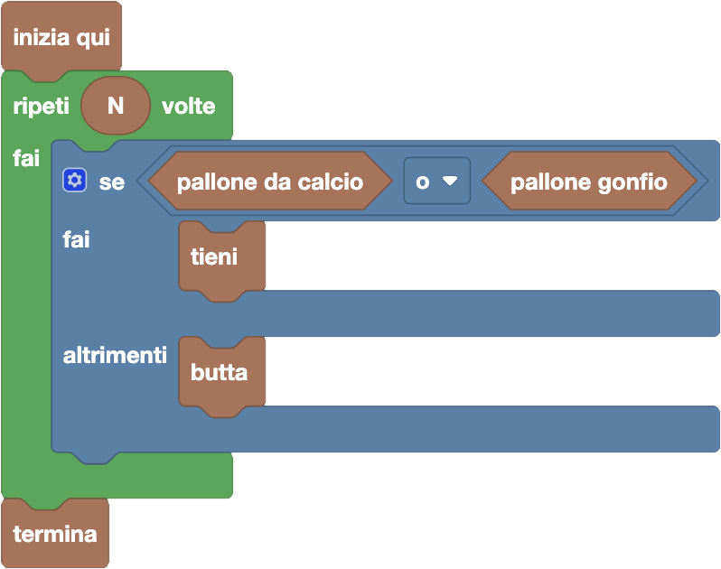

import initialBlocks from "./initialBlocks.json";
import customBlocks from "./s1.blocks.yaml";
import testcases from "./testcases.py";
import Visualizer from "./visualizer.jsx";

Tip-Tap deve sistemare la sua vecchia collezione di $N$ palloni.
Non avendo spazio per tutti, ha deciso che terrà **tutti i palloni da calcio** e i **palloni da basket gonfi**,
mentre butterà i **palloni da basket sgonfi**.

Per farlo, Tip-Tap può compiere le seguenti azioni:

- `tieni`: metti via il prossimo pallone nello scaffale.
- `butta`: butta via il prossimo pallone nel cestino.
- `pallone da calcio`: condizione vera se il prossimo pallone è da calcio.
- `pallone gonfio`: condizione vera se il prossimo pallone è gonfio.
- `termina`: finisci di mettere a posto i palloni.

Scrivi un programma che consenta a Tip-Tap di sistemare tutti i suoi palloni!

<Blockly
  customBlocks={customBlocks}
  initialBlocks={initialBlocks}
  testcases={testcases}
  debug={{ logBlocks: false, logJs: false, logVariables: false }}
  visualizer={Visualizer}
/>

> Un possibile programma corretto è il seguente:
>
> 
>
> Secondo questo programma, per ognuno degli $N$ palloni che Tip-Tap deve sistemare, il protagonista
> controlla se il prossimo pallone è da calcio o gonfio. Se sì lo tiene, altrimenti lo butta.
>
> 
