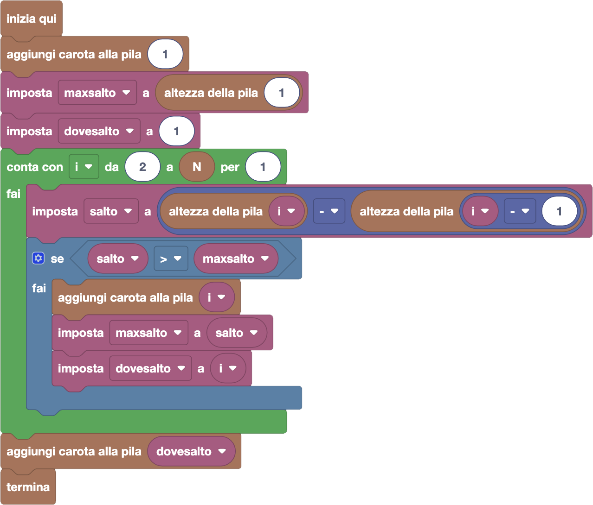

import initialBlocks from "./initialBlocks.json";
import customBlocks from "./s2.blocks.yaml";
import testcases from "./testcases.py";
import Visualizer from "./visualizer.jsx";

Carol sta organizzando una gara di salto nel fienile della fattoria Fibonacci!

Il fienile ha $N$ **pile** di balle di fieno, l'$i$-esima delle quali composta da $H_i$ balle di fieno.
La gara partirà dall'ingresso del fienile a sinistra, prima di tutte le pile. Da lì i conigli dovranno
saltare sulla prima pila $i = 1$, e poi via via sulle successive, fino ad arrivare all'ultima pila e
saltare fuori dal fienile a destra.

I conigli non fanno fatica a saltare in piano o in basso, ma saltare verso l'alto non è facile!
Quindi, Carol vuole mettere una carota come premio su **ogni** pila di balle di fieno che richiede
un salto **maggiore** di tutti i salti fatti prima per arrivare fino a lì. Inoltre, vuole mettere
una seconda carota sul salto più alto di tutti del percorso. Carol può fare queste cose:

- `altezza della pila i`: guarda quante balle di fieno $H_i$ ci sono nella pila $i$-esima.
- `aggiungi carota alla pila i`: aggiungi una carota in cima all'$i$-esima pila.
- `termina`: smetti di aggiungere carote e fai partire la gara.

Aiuta Carol a preparare il fienile per la gara di salto!

<Blockly
  customBlocks={customBlocks}
  initialBlocks={initialBlocks}
  testcases={testcases}
  debug={{ logBlocks: false, logJs: false, logVariables: false }}
  Visualizer={Visualizer}
/>

> Un possibile programma corretto è il seguente:
>
> 
>
> Questo programma, mette subito una carota sulla prima pila, che richiede il primo salto: il primo
> salto è sempre maggiore degli _zero_ salti fatti prima! Il programma poi ricorda che il massimo
> salto finora (_maxsalto_) è alto come la prima pila, ed è stato fatto nella pila $1$ (_dovesalto_).
>
> A questo punto, il programma itera su tutte le altre pile, dalla seconda alla fine.
> Per ciascuna di queste, calcola quanto è grande il _salto_ che serve per arrivare all'$i$-esima pila.
> Se questo salto è maggiore del massimo salto finora, allora va ad aggiungere una carota e lo
> memorizza in _maxsalto_ e _dovesalto_.
>
> Una volta terminato di scorrere tutte le pile, Carol torna all'ultima pila a cui ha aggiunto una
> carota (_dovesalto_) e ci aggiunge la seconda carota.
>
>  
