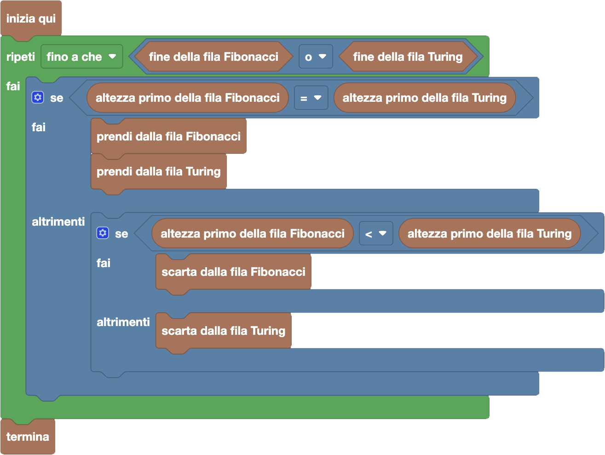

import initialBlocks from "./initialBlocks.json";
import customBlocks from "./s3.blocks.yaml";
import testcases from "./testcases.py";
import Visualizer from "./visualizer.jsx";

Bunny deve selezionare due squadre di basket da **più giocatori possibile** per la sfida tra la fattoria Fibonacci e la fattoria Turing!
Per fare una partita bilanciata, vuole che le due squadre siano composte da uno stesso numero di giocatori della stessa altezza, come in questo caso:

Bunny ha quindi messo in fila, in ordine crescente di altezza, i conigli di entrambe le fattorie.
Ora può fare queste operazioni:

- `fine della fila Fibonacci`: condizione vera se la fila della fattoria Fibonacci è terminata.
- `fine della fila Turing`: condizione vera se la fila della fattoria Turing è terminata.
- `altezza primo della fila Fibonacci`: l'altezza del primo coniglio nella fila della fattoria Fibonacci.
- `altezza primo della fila Turing`: l'altezza del primo coniglio nella fila della fattoria Turing.
- `prendi dalla fila Fibonacci`: prendi il prossimo coniglio dalla fila della fattoria Fibonacci.
- `prendi dalla fila Turing`: prendi il prossimo coniglio dalla fila della fattoria Turing.
- `scarta dalla fila Fibonacci`: scarta il prossimo coniglio dalla fila della fattoria Fibonacci.
- `scarta dalla fila Turing`: scarta il prossimo coniglio dalla fila della fattoria Turing.
- `termina`: completa le squadre e inizia la partita a basket.

Aiuta Bunny a fare le squadre per la partita!

<Blockly
  customBlocks={customBlocks}
  initialBlocks={initialBlocks}
  testcases={testcases}
  visualizer={Visualizer}
/>

> Un possibile programma corretto è il seguente:
>
> 
>
> Questo programma procede a selezionare i conigli fino a che una delle due file non si svuota.
> Se i due primi della fila hanno la stessa altezza, è possibile prenderli entrambi per
> ingrandire la squadra. Se non hanno la stessa altezza Bunny scarta il più basso dei due,
> visto che non ha più speranze di trovare un avversario della stessa altezza nell'altra fila.
>
>  
