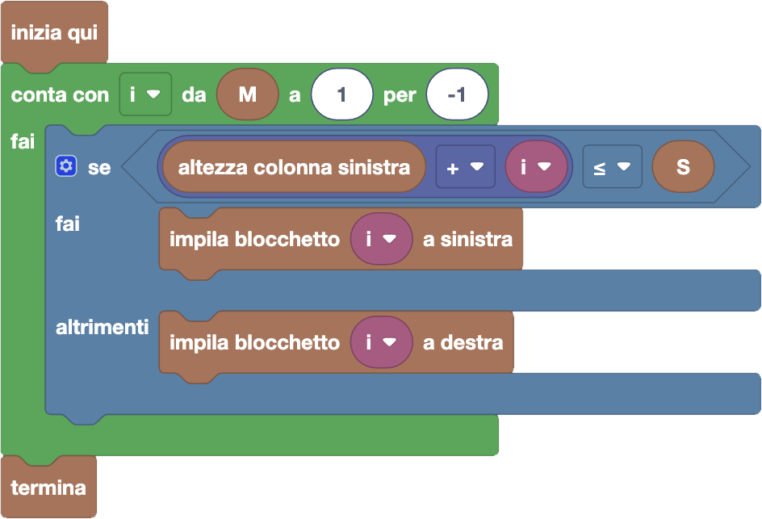

import initialBlocks from "./initialBlocks.json";
import customBlocks from "./s4.blocks.yaml";
import testcases from "./testcases.py";
import Visualizer from "./visualizer.jsx";

Tip-Tap vuole costruire una nuova tettoia per la sua fattoria!
Come prima cosa, ha bisogno di costruire le due colonne portanti:
una a sinistra alta $S$ centimetri, e una a destra alta $D$ centimetri.

Per farlo intende impilare alcuni blocchetti presi da un set da costruzioni,
composto da un singolo blocchetto per ogni altezza possibile tra un minimo
di 1 centimetro e un massimo di $M$ centimetri, e che in tutto arrivano
esattamente all'altezza totale delle due colonne. Ora può fare queste operazioni:

- `altezza colonna destra`: l'altezza corrente della colonna di destra.
- `altezza colonna sinistra`: l'altezza corrente della colonna di sinistra.
- `impila blocchetto i a destra`: aggiunge il blocchetto alto $i$ centimetri alla colonna di destra, se non l'ha già usato.
- `impila blocchetto i a sinistra`: aggiunge il blocchetto alto $i$ centimetri alla colonna di sinistra, se non l'ha già usato.
- `termina`: completa le colonne e costruisci la tettoia.

Aiuta Tip-Tap a completare la tettoia come previsto!

<Blockly
  customBlocks={customBlocks}
  initialBlocks={initialBlocks}
  testcases={testcases}
  debug={{ logBlocks: false, logJs: false, logVariables: false }}
  visualizer={Visualizer}
/>

> Un possibile programma corretto è il seguente:
>
> 
>
> Questo programma procede a selezionare i blocchetti dal più grande al più piccolo.
> Per ogni blocchetto, prova prima se può metterlo nella colonna a sinistra.
> Se non può, prova anche a destra prima di scartarlo definitivamente.
>
> **Approfondimento:** Si può dimostrare che questo procedimento riesce sempre a costruire
> le colonne. Per mostrarlo, consideriamo cosa succede quando vogliamo piazzare il
> blocchetto alto $M$. La più alta delle due colonne deve essere alta più della metà del
> totale, ma $M$ è al massimo la metà del totale dei blocchetti da $1$ a $M$, quindi
> posso sicuramente farlo stare in una delle due colonne. Mettendolo, abbiamo ridotto sia l'altezza
> totale da costruire che l'altezza totale dei blocchetti di $M$, quindi è ancora vero che
> l'altezza totale dei blocchetti è uguale all'altezza totale delle colonne da costruire.
>
> 
