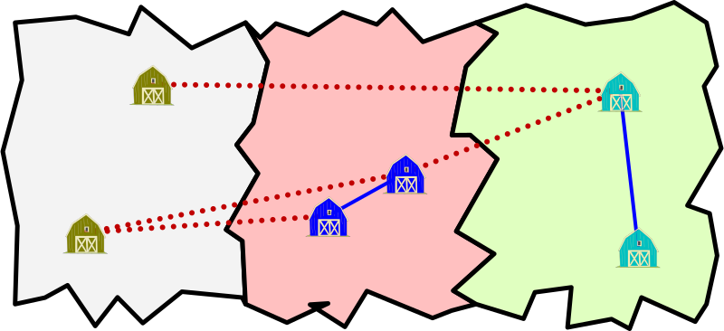
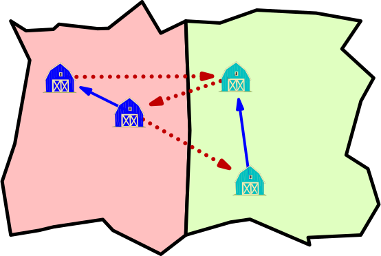

import variants from "./variants.py";

A _Carotandia_ ci sono $\js{n}$ paesi, e in ognuno di essi ci sono $\js{s}$ fattorie.
Tip-Tap vuole costruire delle strade che colleghino tutte le fattorie.
Una strada tra due fattorie dello stesso paese costa $1$ carota, mentre una strada tra fattorie di paesi diversi costa $2$ carote.
Per esempio, se ci fossero tre paesi con due fattorie ciascuno, si potrebbero collegare le fattorie come in figura. Questo piano costa due carote per ognuna delle quattro strade tratteggiate, più una carota per ciascuna delle altre due strade, per un totale di dieci carote:

In questo esempio, ci sono anche altri piani validi, ciascuno con un costo di sette carote o più.
Invece, a _Carotandia_ ci sono $\js{n}$ paesi con $\js{s}$ fattorie:

Qual è il minimo numero di carote che Tip-Tap deve spendere affinché da ogni fattoria si possa raggiungere ogni altra fattoria, eventualmente percorrendo più strade?  

- [x] $\js{ans1}$
- [ ] $\js{wrong1[0]}$
- [ ] $\js{wrong1[1]}$
- [ ] $\js{wrong1[2]}$
- [ ] $\js{wrong1[3]}$

> Dato che le strade all'interno dello stesso paese costano poco, conviene intanto collegare le fattorie all'interno dello stesso paese. Per ogni paese servono $\js{s-1}$ fattorie. Ad esempio, colleghiamo la fattoria $1$ con la fattoria $2$, la fattoria $2$ con la fattoria $3$, ..., la fattoria $\js{s-1}$ con la fattoria $\js{s}$. Quindi il costo parziale è di $\js{n*(s-1)}$ carote.
> Adesso dobbiamo anche connettere i paesi tra di loro, e servono altre $\js{n-1}$ strade di costo $2$ carote. Ad esempio, colleghiamo l'ultima fattoria di ogni paese (tranne l'ultimo) con la prima di quello successivo. Il costo totale è $\js{2*(n-1) + n*(s-1)}$ carote.
>
> 

---

Mettiamo ora che le strade che Tip-Tap costruisce siano a **senso unico**, come in questo esempio:

Questo piano costa otto carote ($3 \times 2 + 2 \times 1$), e consente di poter andare da ogni fattoria ad ogni altra rispettando i sensi unici.
Come prima, ci sono anche altri piani validi, ciascuno con un costo di sei carote o più.
Ricordando che a _Carotandia_ ci sono $\js{n}$ paesi con $\js{s}$ fattorie:

Qual è il minimo numero di carote che Tip-Tap deve spendere affinché da ogni fattoria si possa raggiungere ogni altra fattoria, eventualmente percorrendo più strade, ma rispettando sempre i sensi unici?

- [x] $\js{ans2}$
- [ ] $\js{wrong2[0]}$
- [ ] $\js{wrong2[1]}$
- [ ] $\js{wrong2[2]}$
- [ ] $\js{wrong2[3]}$

> Nel problema precedente, abbiamo formato una linea composta da tutte le $\js{n*s}$ città. Assegniamo lo stesso verso a tutte le strade della linea, in modo che dalla prima città si possa raggiungere l'ultima. Ma in questo modo dall'ultima città non se ne può raggiungere nessun'altra. Per rimediare, basta creare una nuova strada che collega l'ultima città alla prima, pagando un costo aggiuntivo di $2$ carote.
>
> 
