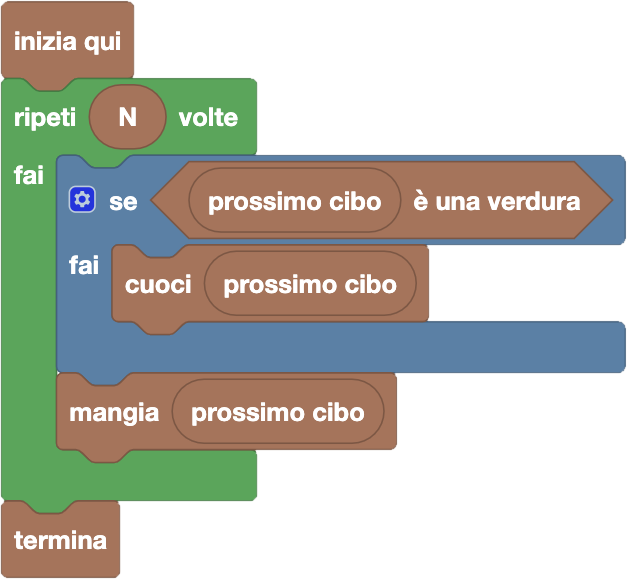

import initialBlocks from "./initial-blocks.json";
import customBlocks from "./s1.blocks.yaml";
import testcases from "./testcases.py";
import Visualizer from "./visualizer.jsx";

Tip-Tap deve preparare il pranzo ed ha allineato $N$ cibi che vuole mangiare.
Ogni cibo è una verdura o un frutto, e Tip-Tap vuole solo mangiare **frutta cruda** e **verdura cotta**.
Hai a disposizione questi blocchi:

- `N`: il numero di cibi che Tip-Tap ha allineato.
- `prossimo cibo`: il prossimo cibo che Tip-Tap non ha ancora mangiato.
- $x$ `è una verdura`: vero se il cibo $x$ è una verdura.
- `cuoci` $x$: cuoci il cibo $x$.
- `mangia` $x$: mangia il cibo $x$.
- `termina`: smetti di mangiare.

Scrivi un programma che consenta a Tip-Tap di pranzare come più preferisce!

<Blockly
  customBlocks={customBlocks}
  initialBlocks={initialBlocks}
  testcases={testcases}
  visualizer={Visualizer}
/>

> Un possibile programma corretto è il seguente:
>
> 
>
> Secondo questo programma, per ognuno degli $N$ cibi che Tip-Tap vuole mangiare, il protagonista
> controlla se il prossimo cibo è una verdura, e in caso affermativo la cuoce prima di mangiarla.
> A questo punto mangia il prossimo cibo (che sia verdura o frutta), che sarà di suo gradimento:
> verdura cotta o frutta cruda.
>
> 
> 
