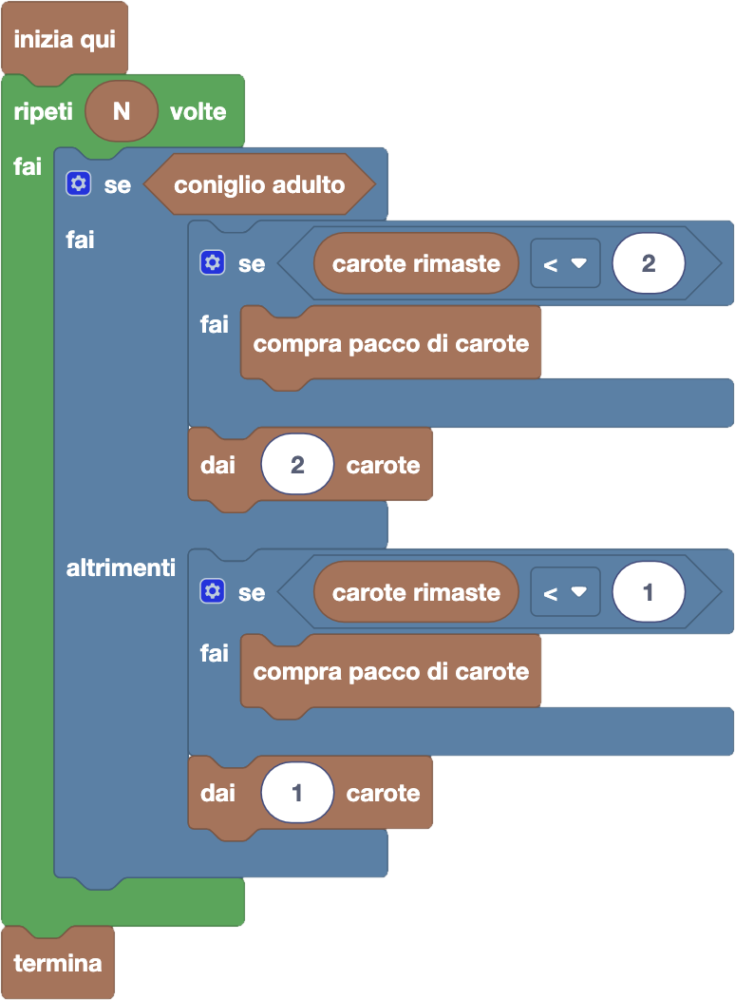

import initialBlocks from "./initial-blocks.json";
import customBlocks from "./s2.blocks.yaml";
import testcases from "./testcases.py";
import Visualizer from "./visualizer.jsx";

Carol è stata incaricata di distribuire carote ai suoi $N$ amici di fattoria.
I conigli, sia adulti che bambini, si sono quindi messi in fila e Carol deve dare 2 carote ad ogni adulto e una carota ad ogni bambino.
Per soddisfare le richieste di tutti, Carol può comprare dei pacchi da $K$ carote al costo di 1 euro.
Hai a disposizione questi blocchi:

- `N`: il numero di amici di Carol.
- `K`: il numero di carote in un pacco.
- `coniglio adulto`: vero se il prossimo coniglio in fila è adulto.
- `dai` $x$ `carote`: consegna $x$ carote al prossimo coniglio in fila.
- `compra pacco di carote`: acquista un pacco di $K$ carote, al prezzo di 1 euro.
- `carote rimaste`: quante carote sono rimaste al momento a Carol.
- `termina`: smetti di consegnare carote.

Aiuta Carol a distribuire le carote a tutti come previsto, spendendo meno possibile! 

<Blockly
  customBlocks={customBlocks}
  initialBlocks={initialBlocks}
  testcases={testcases}
  visualizer={Visualizer}
/>

> Un possibile programma corretto è il seguente:
>
> 
>
> Secondo questo programma, per ognuno degli $N$ amici in fila, il protagonista innanzitutto
> controlla se il prossimo coniglio è adulto. In caso affermativo, prima di dargli le due carote
> che gli spettano verifica di averne abbastanza, e se non fosse così ne compra un nuovo pacco.
>
> Se invece il prossimo coniglio è un bambino, anche in quel caso prima di dargli la carota che
> gli spetta controlla di averne almeno una, comprando un nuovo pacco se non fosse così.
>
> 
