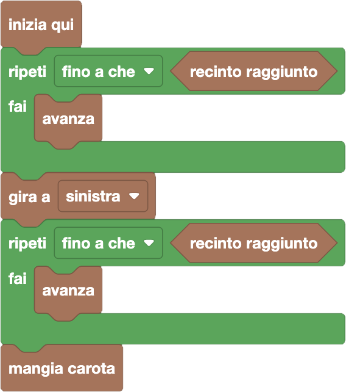
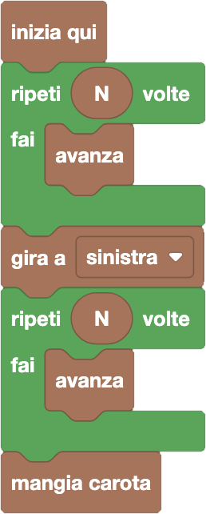
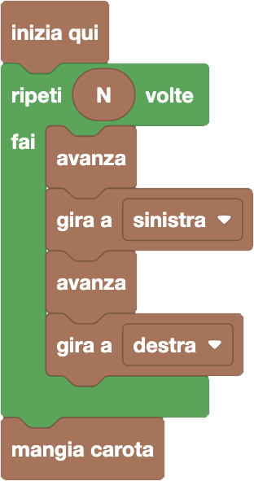

import initialBlocks from "./initial-blocks.json";
import customBlocks from "./s1.blocks";
import testcases from "./testcases.py";
import Visualizer from "./visualizer";
import { Hint } from "~/utils/hint";
import { toolbox } from "./toolbox.ts";

L'orto della fattoria Fibonacci è fatto come una griglia quadrata, con $N$ aiuole per ogni lato, il tutto racchiuso da un recinto.
Carol è saltata dentro al recinto e si trova ora nell'angolo della griglia in basso a sinistra, orientata verso destra. In alto a destra si trova invece una carota,
e Carol vuole mangiarla seguendo le linee della griglia! Hai a disposizione questi blocchi:

- `N`: la dimensione dei lati della griglia;
- `recinto raggiunto`: vero se Carol sta ora di fronte al recinto (e quindi non potrebbe avanzare oltre);
- `avanza`: avanza al prossimo passo della griglia;
- `gira a destra/sinistra`: gira sul posto verso destra/sinistra;
- `mangia carota`: mangia la carota se la si è raggiunta.

Aiuta Carol ad attraversare l'orto e mangiare la carota!

<Hint label="descrizione figure per ipovedenti">
  - **Livello 1:** griglia 2 per 2. 
  - **Livello 2:** griglia 1 per 1.
  - **Livello 3:** griglia 4 per 4.
  - **Livello 4:** griglia 7 per 7.
</Hint>

<Blockly
  toolbox={toolbox}
  customBlocks={customBlocks}
  initialBlocks={initialBlocks}
  testcases={testcases}
  visualizer={Visualizer}
/>

> Ci sono molti modi in cui Carol può raggiungere la carota.
> Per esempio, potrebbe avanzare finché non raggiunge la fine dell'orto, poi girare verso sinistra per poi avanzare sull'altro lato dell'orto fino alla fine, e a quel punto mangiare la carota.
>
> 
>
> In alternativa, potrebbe fare lo stesso movimento ma basandosi sulla dimensione $N$ della griglia e il ciclo "ripeti N": quindi avanzare $N$ volte, girare a sinistra, e di nuovo avanzare $N$ volte.
>
> 
>
> Carol può anche seguire altri percorsi, invece di seguire il bordo in basso e a sinistra dell'orto. Per esempio, potrebbe procedere "a zig-zag" in diagonale come in questo codice.
>
> 
>
> Molte altre soluzioni sono possibili, ma sono tutte simili a quelle riportate qui sopra.
