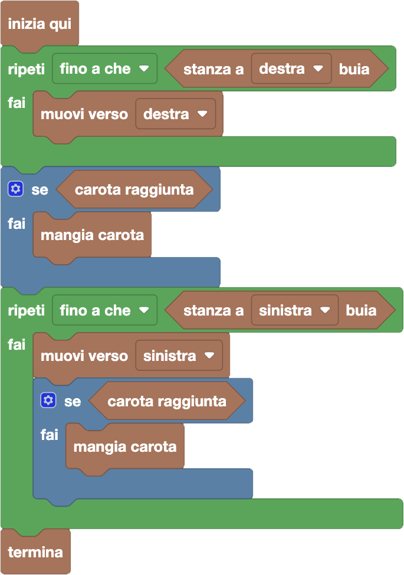

import initialBlocks from "./initial-blocks.json";
import customBlocks from "./s2.blocks";
import testcases from "./testcases.py";
import Visualizer from "./visualizer";
import { Hint } from "~/utils/hint";
import { toolbox } from "./toolbox.ts";

Bunny si trova nel lungo corridoio di $N$ stanze della fattoria, e gli è tornata la paura del buio!
Tuttavia, gli è anche tornata un po' di fame. Per fortuna, in alcune stanze nel corridoio sono state lasciate delle carote.
Bunny vuole mangiare più carote possibile muovendosi nel corridoio, ma senza mai entrare in una stanza buia.
Hai a disposizione questi blocchi:

- `N`: il numero di stanze nel corridoio.
- `stanza a destra/sinistra buia`: vero se stanza a destra/sinistra è buia.
- `muovi verso destra/sinistra`: spostati nella prossima stanza verso destra/sinistra.
- `carota raggiunta`: vero se c'è una carota nella stanza corrente.
- `mangia carota`: mangia la carota nella stanza corrente.
- `termina`: smetti di cercare le carote.

Aiuta Bunny a mangiare tutte le carote che può raggiungere evitando il buio!

<Hint label="descrizione figure per ipovedenti">
  Le stanze sono numerate da 1.

  - **Livello 1:** corridoio di {testcases[0].N} stanze, con il coniglio che parte nella stanza {testcases[0].pos+1}. Le stanze sono, in ordine: {testcases[0].lightDesc}. Ci sono carote nelle stanze {testcases[0].carrotDesc}.
  - **Livello 2:** corridoio di {testcases[1].N} stanze, con il coniglio che parte nella stanza {testcases[1].pos+1}. Le stanze sono, in ordine: {testcases[1].lightDesc}. Ci sono carote nelle stanze {testcases[1].carrotDesc}.
  - **Livello 3:** corridoio di {testcases[2].N} stanze, con il coniglio che parte nella stanza {testcases[2].pos+1}. Le stanze sono, in ordine: {testcases[2].lightDesc}. Ci sono carote nelle stanze {testcases[2].carrotDesc}.
  - **Livello 4:** corridoio di {testcases[3].N} stanze, con il coniglio che parte nella stanza {testcases[3].pos+1}. Le stanze sono, in ordine: {testcases[3].lightDesc}. Ci sono carote nelle stanze {testcases[3].carrotDesc}.
</Hint>

<Blockly
  toolbox={toolbox}
  customBlocks={customBlocks}
  initialBlocks={initialBlocks}
  testcases={testcases}
  visualizer={Visualizer}
/>

> Bunny può muoversi solo nella zona di stanze illuminate in cui si trova, e deve percorrerle tutte per poter raccogliere tutte le carote presenti.
>
> Per esempio, può iniziare andando verso destra fino alla fine delle stanze illuminate.
> Può quindi raccogliere la carota nella stanza in cui è arrivato.
> A quel punto, deve tornare verso sinistra fino alla fine delle stanze illuminate, mentre raccogliere le carote ogni volta che le incontra.
>
> 
