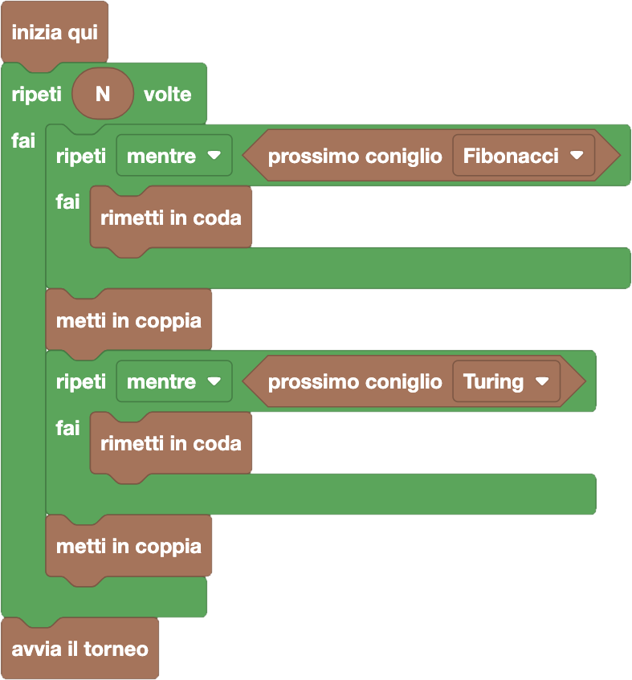

import initialBlocks from "./initial-blocks.json";
import customBlocks from "./s3.blocks";
import testcases from "./testcases.py";
import Visualizer from "./visualizer";
import { Hint } from "~/utils/hint";
import { toolbox } from "./toolbox.ts";

Allie ha organizzato un torneo di _scherma a carote_ tra la fattoria Fibonacci e la fattoria Turing.
Ha quindi invitato i migliori $N$ conigli da ciascuna fattoria perché si possano sfidare con i migliori $N$ dell'altra.
Purtroppo, i partecipanti si sono messi tutti alla rinfusa in una fila che ora ha $2 \times N$ conigli. Ora tocca ad Allie riportare un
po' d'ordine e combinare i conigli a coppie così che si possano sfidare!
Hai a disposizione questi blocchi:

- `N`: il numero di conigli da ciascuna fattoria.
- `prossimo coniglio Fibonacci/Turing`: vero se il prossimo coniglio in fila è della fattoria Fibonacci/Turing.
- `metti in coppia`: metti il prossimo coniglio in fila nella prossima coppia che si deve sfidare.
- `rimetti in coda`: prendi il prossimo coniglio in fila e portalo al fondo della fila.
- `avvia il torneo`: smetti di formare le coppie e fai iniziare il torneo.

Aiuta Allie a mettere tutti in coppie di conigli tra fattorie rivali prima di avviare il torneo!

<Hint label="descrizione figure per ipovedenti">
  - **Livello 1:** ci sono {testcases[0].N} conigli in fila, in ordine: {testcases[0].desc}.
  - **Livello 2:** ci sono {testcases[1].N} conigli in fila, in ordine: {testcases[1].desc}.
  - **Livello 3:** ci sono {testcases[2].N} conigli in fila, in ordine: {testcases[2].desc}.
  - **Livello 4:** ci sono {testcases[3].N} conigli in fila, in ordine: {testcases[3].desc}.
</Hint>

<Blockly
  toolbox={toolbox}
  customBlocks={customBlocks}
  initialBlocks={initialBlocks}
  testcases={testcases}
  visualizer={Visualizer}
/>

> Allie deve fare $N$ coppie, quindi può impostare il suo procedimento facendo un "ripeti N" delle
> istruzioni necessarie per fare una singola coppia.
>
> Per fare una coppia, deve trovare un coniglio da ciascuna fattoria.
> Per esempio, può decidere di cominciare prendendo un coniglio dalla fattoria Turing,
> rimandando quindi in coda i conigli della fattoria Fibonacci finché non ne arriva uno della fattoria Turing.
> A questo punto può mettere il primo coniglio in coda, che dovrà essere della fattoria Turing, nella prossima coppia di sfidanti.
>
> Ora gli serve un coniglio della fattoria Fibonacci da mettere in coppia.
> Può quindi procedere rimandando in coda i conigli della fattoria Turing, finché non ne arriva uno della fattoria Fibonacci.
> A questo punto può mettere il primo coniglio in coda, che dovrà essere della fattoria Fibonacci, nella prossima coppia di sfidanti.
>
> 
