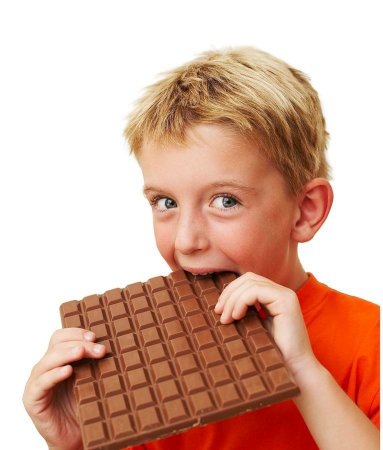
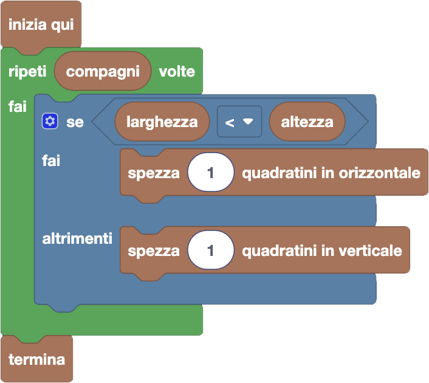

import customBlocks from "./customBlocks.yaml";
import initialBlocks from "./initialBlocks.json";
import testcases from "./testcases.py";
import Visualizer from "./visualizer.jsx";

Tip-Tap adora il cioccolato, e allora si è comprato una tavoletta di cioccolato fatta di $N \times M$ quadratini.
Anche i $K$ suoi compagni di fattoria vorrebbero mangiare il cioccolato, e Tip-Tap è troppo buono per non dargliene!
Quindi per $K$ volte spezza la tavoletta in due parti rettangolari, non necessariamente uguali, e dà una delle due ad uno dei suoi $K$ compagni tenendo infine l'ultimo pezzo per sè.

La tavoletta può essere spezzata solo lungo i bordi dei quadratini, in orizzontale o verticale, in modo tale da non dividere nessun quadratino in due.
Inoltre una volta spezzata una parte, quella viene subito presa e mangiata da un amico senza dargli la possibilità di spezzarla ulteriormente.
Tip-Tap vorrebbe sapere come spezzare la tavoletta $K$ volte in modo che gli rimangano il maggior numero possibile di quadratini. Puoi aiutarlo?

Puoi usare questi blocchi:

- `larghezza`: la larghezza attuale della tavoletta.
- `altezza`: l'altezza attuale della tavoletta.
- `compagni`: il numero di compagni che ancora chiedono del cioccolato.
- `spezza x quadratini in orizzontale`: spezza la tavoletta in orizzontale, lasciando $x$ file ad un compagno.
- `spezza x quadratini in verticale`: spezza la tavoletta in verticale, lasciando $x$ colonne ad un compagno.
- `termina`: mangia il cioccolato rimasto.

Aiuta Tip-Tap a spezzare la tavoletta $K$ volte, in modo gli rimanga il maggior numero possibile di quadratini!

<Blockly
  customBlocks={customBlocks}
  initialBlocks={initialBlocks}
  testcases={testcases}
  debug={{ logBlocks: false, logJs: false, logVariables: false }}
  Visualizer={Visualizer}
/>

> Un possibile programma corretto è il seguente:
>
> 
>
> Secondo questo programma, per ognuno dei compagni di Tip-Tap, il protagonista
> controlla se la tavoletta è più larga o più alta, e gli passa una singola fila
> o colonna a seconda di quale delle due è più piccola. In questo modo, si
> assicura che alla fine gli rimanga più cioccolato possibile.
