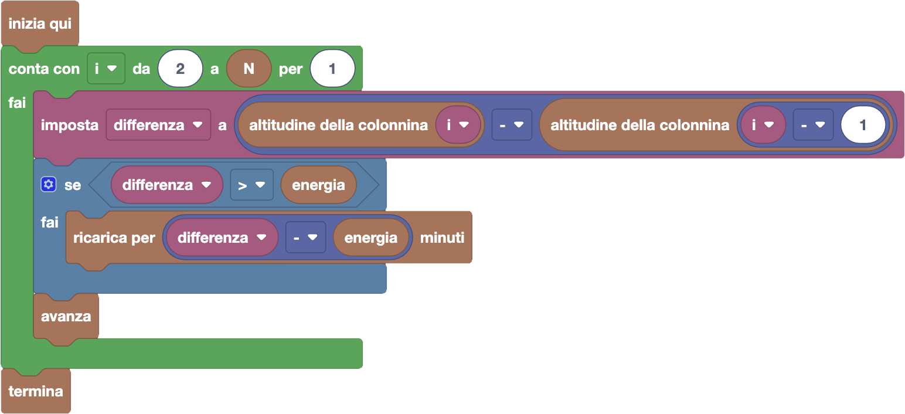
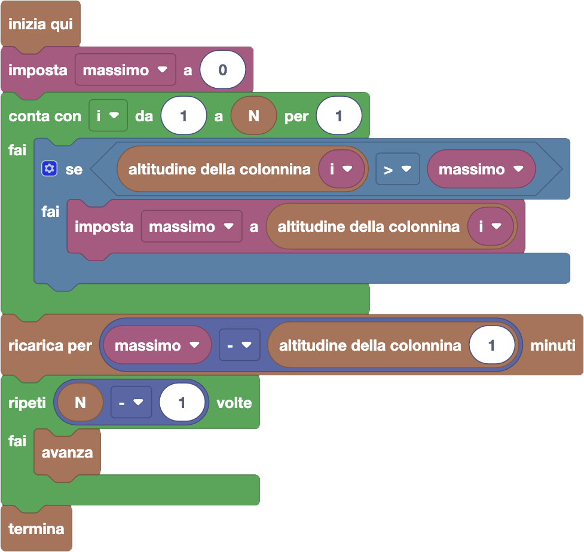

import initialBlocks from "./initialBlocks.json";
import customBlocks from "./customBlocks.yaml";
import testcases from "./testcases.py";
import Visualizer from "./visualizer.jsx";

I conigli della fattoria Fibonacci hanno appena comprato una nuova efficentissima macchina elettrica!

Non vedono l'ora di provarla, quindi organizzano un viaggio di prova sulle montagne vicine. Il tragitto che vogliono fare è fatto da tratti in salita e tratti in discesa.
Lungo il percorso ci sono $N$ colonnine di ricarica dove potersi fermare, a diverse altezze. La macchina **usa** un'unità di energia **salendo** di $1$ metro di altitudine,
mentre **guadagna** un'unità di energia **scendendo** di $1$ metro di altitudine, e non le serve energia per avanzare nei tratti in piano.
Purtroppo la macchina parte senza energia, e per ricaricarsi può attendere **un minuto** ad una delle colonnine per ogni unità di energia che vuole ottenere in quel momento.

Puoi usare questi blocchi:

- `N`: la lunghezza $N$ del percorso.
- `energia`: la quantità corrente di energia.
- `altitudine della colonnina i`: l'altitudine della colonnina di ricarica $i$-esima nel percorso.
- `avanza`: prosegui il viaggio fino alla prossima colonnina, se hai abbastanza energia.
- `ricarica per x minuti`: attendi $x$ minuti ad una colonnina per ricaricare $x$ unità di energia.
- `termina`: spegni la macchina.

I conigli partono dalla colonnina 1, e devono arrivare alla colonnina $N$.
Organizza il viaggio sulle montagne, evitando che la macchina si fermi prima di arrivare!

<Blockly
  customBlocks={customBlocks}
  initialBlocks={initialBlocks}
  testcases={testcases}
  debug={{ logBlocks: false, logJs: false, logVariables: false }}
  Visualizer={Visualizer}
/>

> Un possibile programma corretto è il seguente:
>
> 
>
> Secondo questo programma, per ognuna delle colonnine a partire dalla seconda, si controlla
> se c'è abbastanza energia rimasta per coprire la differenza di altezza tra la prossima
> colonnina $i$ e quella corrente $i-1$. Se non è sufficiente, ci si ricarica
> alla colonnina per la quantità di minuti minima indispensabile. Poi in ogni
> caso si procede alla colonnina successiva.
>
> Un altro possibile approccio è il seguente:
>
> 
>
> Secondo questo programma, prima si calcola la massima altezza di una qualunque colonnina
> lungo il percorso. A questo punto, ci si ricarica una singola volta della quantità di energia
> necessaria per salire dall'altezza iniziale fino all'altezza massima. A questo punto c'è
> abbastanza energia per procedere fino alla fine senza fermarsi.
