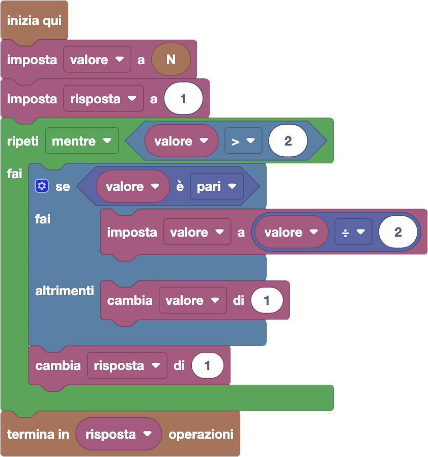

import customBlocks from "./customBlocks.yaml";
import initialBlocks from "./initialBlocks.json";
import testcases from "./testcases.py";
import Visualizer from "./visualizer.jsx";

Carol ha fatto cadere la sua calcolatrice, e ora non funziona più come dovrebbe!
Gli unici tasti funzionanti sono il $-$, il $\times$, l'$1$ e il $2$.
Per utilizzare la calcolatrice è costretta a partire dal numero $1$ o dal numero $2$ (premendo il tasto corrispondente) e applicare zero o più volte una delle $4$ possibili operazioni funzionanti:

- sottrarre $1$
- sottrarre $2$
- moltiplicare per $1$
- moltiplicare per $2$

Per fare uno scherzo ai suoi amici, vorrebbe raggiungere sulla calcolatrice il numero $N$. Quante operazioni deve fare al minimo per farlo?

_**Nota:** premere il tasto $1$ o $2$ all'inizio conta come un'operazione, inoltre la calcolatrice è danneggiata quindi Carol è costretta a partire sempre da $1$ o $2$ (**non** può ad esempio premere $2$ e poi $1$ per partire dal numero $21$) e le uniche operazioni ammesse sono quelle precedentemente elencate (**non** può per esempio moltiplicare o sottrarre $12$ o $21$)._

Puoi usare questi blocchi:

- `N`: il numero $N$ che vuole raggiungere.
- `termina in x operazioni`: riporta che è possibile raggiungere il numero $N$ in $x$ operazioni.

_**Attenzione:** non ti viene richiesto di ricostruire le operazioni da fare, basta che calcoli il numero di operazioni necessario!_

<Blockly
  customBlocks={customBlocks}
  initialBlocks={initialBlocks}
  testcases={testcases}
  debug={{ logBlocks: false, logJs: false, logVariables: false }}
  Visualizer={Visualizer}
/>

> Un possibile programma corretto è il seguente:
>
> 
>
> L'idea di questa soluzione è di ragionare al contrario, partendo dal numero
> che si vuole raggiungere e tornando indietro con le operazioni inverse. Per
> esempio, se vogliamo raggiungere il numero 5, ci chiediamo quale numero potrebbe
> essere l'ultimo che raggiungiamo prima di arrivare al 5. Visto che 5 è dispari,
> non può essere che l'ultima operazione sia un raddoppio, e moltiplicare per 1
> non è mai utile. Quindi il numero prima potrebbe essere o il 6 (da cui sottraendo
> 1 si arriva al 5), oppure il 7 (da cui sottraendo 2 si arriva al 5). Il 7 però
> non sembra conveniente, perché essendo dispari ci si può arrivare solo da un'altro
> numero ancora più grande (8 o 9), il che ci allontana dal nostro obiettivo.
> Si può quindi mostrare che quando dobbiamo raggiungere un valore $n$ dispari,
> la cosa migliore è raggiungere prima $n+1$. Similmente, quando dobbiamo raggiungere
> un valore $n$ pari, la cosa migliore è raggiungere prima $n/2$. Ripetiamo quindi
> questo procedimento a ritroso a partire dal nostro obiettivo $N$, fino a che
> non raggiungiamo 1 o 2, che sono numeri che possiamo direttamente scrivere
> sulla nostra calcolatrice. Nel frattempo contiamo quante operazioni stiamo
> facendo nella variabile risposta, risolvendo il quesito!
