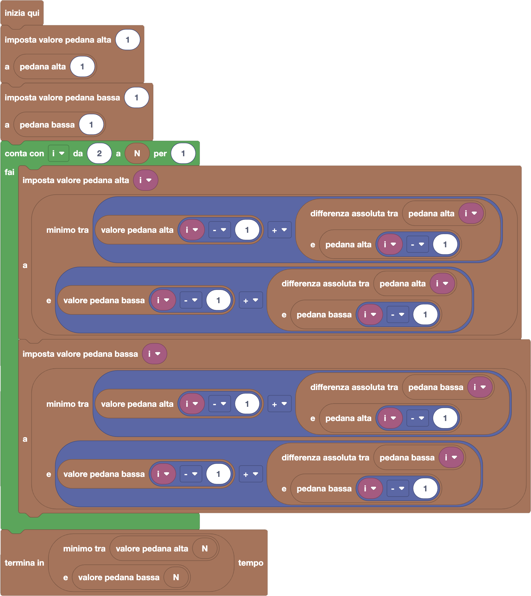

import initialBlocks from "./initialBlocks.json";
import customBlocks from "./s4.blocks.yaml";
import testcases from "./testcases.py";
import Visualizer from "./visualizer.jsx";

Il nuovissimo videogioco _SuperBunny_ è finalmente in commercio! Bunny, il protagonista del videogioco, in ogni livello deve superare $N$ ostacoli numerati da $1$ ad $N$.
Su ogni ostacolo ci sono $2$ pedane (ad altezze diverse) su cui Bunny può saltare: l'ostacolo numero $i$ è fatto da una pedana più in alto che si trova ad una altezza di $A_i$ metri, e da una pedana più in basso ad un'altezza di $B_i$ metri.

Bunny parte da terra ad altezza $0$ e deve per prima cosa saltare sull'ostacolo numero $1$ scegliendo una delle due pedane. Una volta raggiunto l'ostacolo $1$, sceglierà una delle due pedane dell'ostacolo successivo, il $2$, e ci salterà sopra.
L'obiettivo del gioco è superare in ordine tutti gli ostacoli fino all'ostacolo numero $N$. Anche se Bunny può scegliere ogni volta su quale pedana di un ostacolo saltare, non tutti i salti sono uguali!
Infatti, più il salto è grande e più tempo ci vuole per farlo. Per saltare da pedana ad altezza $h$ fino ad una pedana sull'ostacolo successivo ad altezza $k$, Bunny ci metterà una quantità di secondi pari alla _differenza assoluta_ tra $h$ e $k$.

_**Nota:** la differenza assoluta tra $h$ e $k$, in formule $|h - k|$, indica il valore della differenza tra $h$ e $k$ ignorando il segno: quindi $h - k$ se $h > k$ o $k - h$ se $k > h$._

Il tempo totale impiegato per completare un livello è la somma dei tempi impiegati in ogni salto. Quanti secondi servono a Bunny per completare il livello?
Puoi usare questi blocchi:

- `N`: il numero $N$ di ostacoli.
- `pedana alta i`: l'altezza $A_i$ della $i$-esima pedana più in alto.
- `pedana bassa i`: l'altezza $B_i$ della $i$-esima pedana più in basso.
- `differenza assoluta tra x e y`: la differenza assoluta $|x - y|$ tra $x$ e $y$.
- `minimo tra x e y`: il valore minimo tra due numeri $x$ e $y$.
- `termina in x tempo`: riporta che è possibile raggiungere l'$N$-esimo ostacolo in $x$ tempo.

Inoltre, se ti serve, avrai la possibilità di annotarti un valore a tua scelta su ogni piattaforma, che verrà anche mostrato nella figura, con questi blocchi:

- `valore pedana alta i`: il valore scritto sulla pedana alta $i$-esima.
- `valore pedana bassa i`: il valore scritto sulla pedana bassa $i$-esima.
- `imposta valore pedana alta i a x`: scrivi sulla pedana alta $i$-esima il valore $x$.
- `imposta valore pedana bassa i a x`: scrivi sulla pedana bassa $i$-esima il valore $x$.

_**Attenzione:** non ti viene richiesto di ricostruire i salti da fare, basta che calcoli il tempo necessario!_

_**Avvertimento:** incastrare un blocco grosso in un altro blocco può non essere semplice. Cerca di mettere la **punta sinistra** del blocco grosso nello spazio in cui vuoi inserirlo, per non avere difficoltà!_

<Blockly
  customBlocks={customBlocks}
  initialBlocks={initialBlocks}
  testcases={testcases}
  debug={{ logBlocks: false, logJs: false, logVariables: false }}
  visualizer={Visualizer}
/>

> Un possibile programma corretto è il seguente:
>
> 
>
> In questo programma, segnamo come valore su ciascuna pedana il **tempo minimo per raggiungerla**.
> Per le pedane sul primo ostacolo, il tempo per raggiungerle è pari alla loro altezza.
> Per ogni pedana successiva (alta o bassa), il tempo minimo per raggiungerla è pari al minimo tra due cose:
>
> - se decidiamo di arrivarci dalla pedana alta precedente, allora è pari al tempo minimo (valore) della pedana alta precedente, più la differenza assoluta tra la pedana che stiamo considerando e la pedana alta precedente;
> - se decidiamo di arrivarci dalla pedana bassa precedente, allora si può calcolare analogamente ma considerando il valore e la differenza assoluta con la pedana bassa precedente.
>
> Una volta scritti tutti questi valori, il migliore tempo per chiudere il livello sarà il minore
> tra il tempo minimo (valore) per raggiungere l'ultima pedana alta, e il tempo minimo (valore)
> per raggiungere l'ultima pedana bassa.
