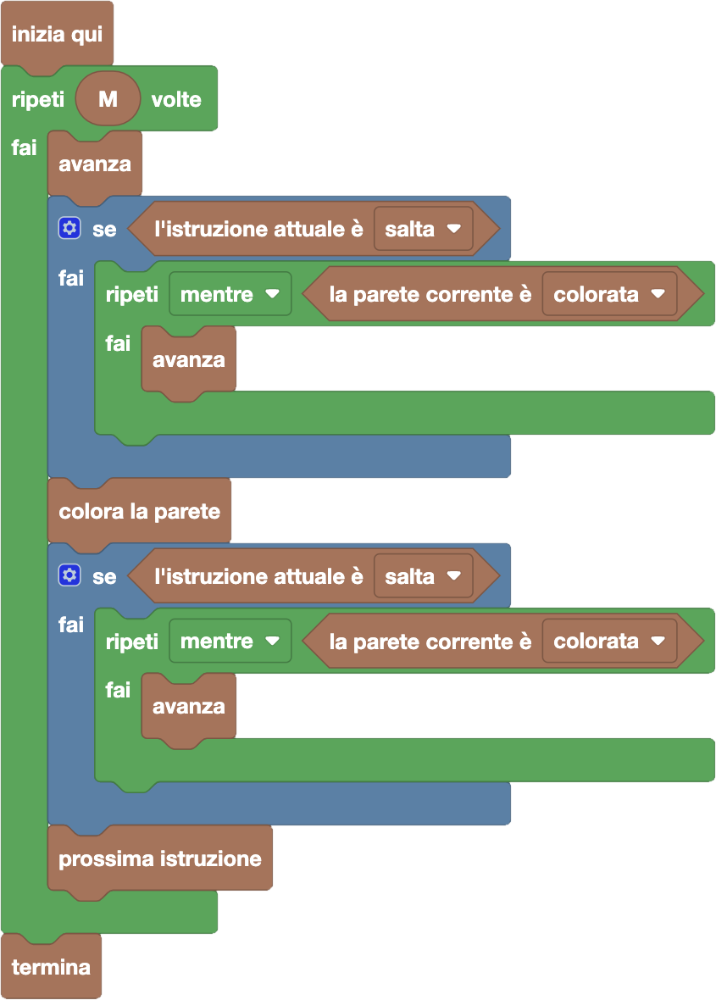

import initialBlocks from "./initial-blocks.json";
import customBlocks from "./s4.blocks.yaml";
import testcases from "./testcases.py";
import Visualizer from "./visualizer.jsx";

Allie è stata incaricata da Carol di dipingere il muro della fattoria, formato da $N$ pareti quadrate numerate da $1$ a $N$.
Alcune pareti sono già colorate, mentre altre sono bianche.
Carol ha dato ad Allie un foglio con $M$ istruzioni di due tipi:
- **AVANZA**: passa alla parete successiva.
- **SALTA**: spostati in avanti (di almeno una casella) fino a che non trovi una parete bianca.

Il modo di seguire queste istruzioni è però piuttosto complicato! Infatti, Allie deve seguire ripetutamente questi passi, per ogni $i$ da $1$ fino ad $M$:
1. Partire (o ripartire) dalla prima parete.
1. Seguire le prime $i$ istruzioni sul foglio.
1. Dipingere la parete su cui si ferma.

Aiuta Allie a dipingere il muro della fattoria facendo in modo che il risultato finale sia quello desiderato da Carol! Hai a disposizione questi blocchi:

- `N`: il numero di pareti.
- `M`: il numero di istruzioni.
- `l'istruzione attuale è salta/avanza`: vero se la prossima istruzione da eseguire è salta/avanza.
- `la parete corrente è bianca/colorata`: vero se la parete davanti a Allie è bianca/colorata.
- `colora la parete`: Allie colora la parete davanti a sé.
- `avanza`: Allie passa alla parete successiva.
- `prossima istruzione`: Allie passa all'istruzione successiva.
- `torna all'inizio`: Allie torna davanti alla prima parete, e ricomincia a leggere le istruzioni dalla prima.
- `termina`: Allie avvisa Carol che ha terminato il lavoro.

**ATTENZIONE**: Allie non deve per forza eseguire tutto il complicato procedimento assegnatole da Carol: le basta fare in modo che il risultato finale sia lo stesso.
In particolare, per completare l'ultimo livello, Allie non deve mai tornare indietro (quindi non può usare l'azione `torna all'inizio`) ma deve comunque fare in modo che il muro sia dipinto come vuole Carol.

<Blockly
  customBlocks={customBlocks}
  initialBlocks={initialBlocks}
  testcases={testcases}
  visualizer={Visualizer}
/>

> Un possibile programma che segue esattamente le istruzioni di Allie è il seguente:
>
> 
>
> Per ogni $i$ da $1$ ad $M$, come prima cosa Carol esegue le prime $i$ istruzioni.
> Questo viene fatto con un ciclo che per $i$ volte esegue la prossima istruzione:
> avanza sempre di uno, e poi se l'istruzione è salta avanza ulteriormente finché
> Carol si trova su di una parete colorata. Terminato il ciclo, Carol colora la parete
> a cui è arrivata e poi riparte dall'inizio.
>
> Il procedimento indicato da Allie, tuttavia, non è molto efficiente! Carol può ottenere
> lo stesso risultato precedente senza mai tornare indietro, con questo programma:
>
> 
>
> L'idea in questo programma è dopo aver seguito le prime $i$ istruzioni e colorato l'ultima
> casella, se ripeto di nuovo le prime $i$ istruzioni, arrivo esattamente nello stesso punto
> in cui già mi trovo! L'unica differenza è se l'ultima istruzione era **SALTA**, perché in quel
> caso devo saltare anche la casella che ho appena colorato. Dopo aver fatto quello, posso
> semplicemente passare alla prossima istruzione senza ripartire dall'inizio.
>
> 
