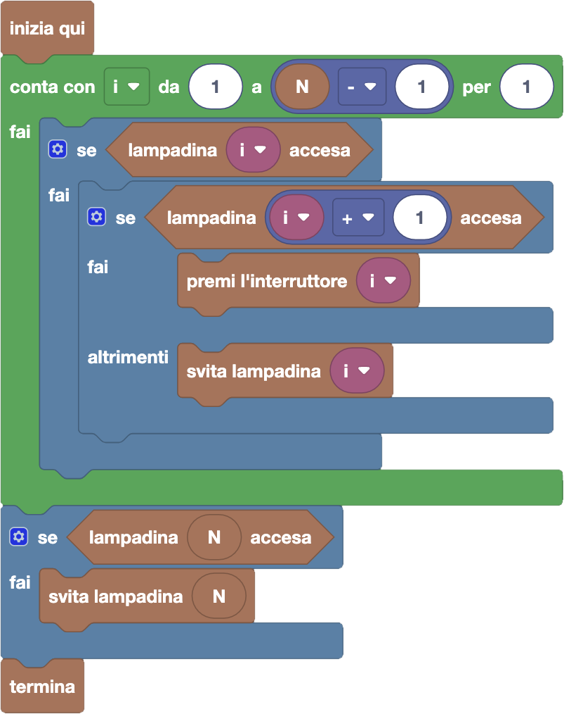

import initialBlocks from "./initial-blocks.json";
import customBlocks from "./s2.blocks.yaml";
import testcases from "./testcases.py";
import Visualizer from "./visualizer.jsx";

Bunny ha superato la paura del buio, e deve spegnere tutte le $N$ lampadine nel lungo corridoio della fattoria prima di andare a dormire!
Tuttavia, la disposizione degli interruttori nel corridoio è un po' particolare: ce ne è uno in mezzo a ogni due lampadine vicine, collegato ad entrambe.
In particolare, gli interruttori numerati da $1$ a $N-1$ sono tali per cui l'$i$-esimo è collegato alle lampadine $i$-esima e $(i+1)$-esima.
Premendo l'interruttore, entrambe le lampadine collegate si spegneranno se sono accese (o accenderanno se sono spente).
Questo rende un po' complicato spegnere tutto, quindi Bunny ha deciso non andare troppo per il sottile, e se serve svitare direttamente alcune lampadine.
Hai a disposizione questi blocchi:

- `N`: il numero di lampadine.
- `lampadina` $i$ `accesa`: vero se la lampadina $i$-esima è accesa.
- `svita lampadina` $i$: svita l'$i$-esima lampadina, rendendola spenta (e non più accendibile dagli interruttori).
- `premi l'interruttore` $i$: premi l'interruttore $i$-esimo, cambiando lo stato delle lampadine collegate (se non sono svitate).
- `termina`: vai a dormire.

Bunny è molto stanco e vorrebbe finire il suo lavoro il prima possibile: porta il buio nel corridoio facendo meno azioni possibile!
Contano come azioni sia svitare una lampadina che premere un interruttore.

<Blockly
  customBlocks={customBlocks}
  initialBlocks={initialBlocks}
  testcases={testcases}
  visualizer={Visualizer}
/>

> Un possibile programma corretto è il seguente:
>
> 
>
> Secondo questo programma, il protagonista scandisce tutti gli interruttori, che sono
> numerati da $1$ a $N-1$, in ordine dal primo. Quando incontra un interruttore, ci sono
> tre casi da considerare:
> 1. Se entrambe le sue due lampadine collegate sono accese, è conveniente premerlo per spegnerle entrambe. 
>    Altrimenti non è conveniente: si rimarrebbe con un numero di lampadine accese uguale se non superiore a prima! 
> 2. Quindi, se solo la lampadina corrente è accesa ma non la successiva, conviene svitarla.
> 3. Se invece la lampadina corrente è spenta, non occorre fare nulla e possiamo andare avanti.
>
> Se poi alla fine del procedimento l'ultima lampadina fosse ancora accesa, bisognerà spegnerla.
